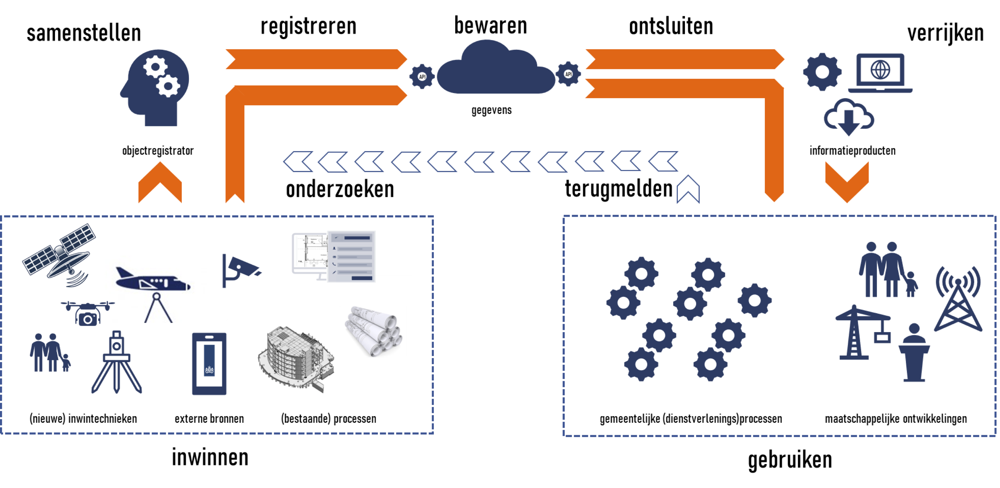

## Afbakening

Dit hoofdstuk beschrijft de afbakening en context van de Objectenregistratie. Het doel hiervan is de grenzen van de Objectenregistratie en de bijdragen (de producten en diensten) ervan aan de omgeving te bepalen. De afbakening brengt in kaart welke rollen en partijen (waaronder bronhouders en afnemers) interactie met de Objectenregistratie hebben en welke soorten interactie er zijn.

### Doel van de Objectenregistratie

Voor de Architectuurbeschrijving van de ICT-voorzieningen voor de Objectenregistratie is het goed het doel van de registratie te kennen. In de [beleidsvisie voor de samenhangende objectenregistratie](https://www.geobasisregistraties.nl/documenten/beleidsnota/2019/11/29/beleidsvisie-samenhangende-objectenregistratie) is een vijftal doelstellingen geformuleerd voor de Objectenregistratie:

1. Een betrouwbare, consistente en actuele samenhangende gegevensset voor heel Nederland;
2. Een efficiëntere inwinning en bijhouding van objecten, ook in drie dimensies (3D);
3. Een betere inpassing in moderne architecturen;
4. Meer en eenvoudiger gebruik van deze informatie in maatschappelijke toepassingen. De registratie gedraagt zich voor de gebruiker als één registratie.
5. De objectenregistratie maakt onderdeel uit van een robuuste geo-informatie infrastructuur binnen de generieke digitale infrastructuur en voldoet aan de [12 eisen voor een basisregistratie](https://www.digitaleoverheid.nl/overzicht-van-alle-onderwerpen/gegevens/naar-een-gegevenslandschap/themas/twaalf-eisen-stelsel-van-basisregistraties/)

### Context voor de Architectuurbeschrijving

**Processtappen Objectenregistratie**

Onderstaande afbeelding toont de globale werking van de Objectenregistratie. *Bronhouders* zorgen voor het **inwinnen** van bronmateriaal zoals luchtfoto's of bouwwerkinformatiemodellen of maken gebruik van door anderen ingewonnen bronmateriaal. Op basis van dit bronmateriaal **stelt** de bronhouder objectgegevens **samen** die voldoen aan de eisen van de Objectenregistratie en **registreert** deze objectgegevens in de opslag van de Objectenregistratie waar ze worden **bewaard**. Vanuit de opslag worden gegevens **ontsloten** richting *afnemers* die deze gegevens **gebruiken** in hun (bedrijfs-)processen. Regelmatig worden de objectgegevens **verrijkt** voordat ze worden gebruikt, bijvoorbeeld door ze te combineren met gegevens uit andere bronnen. Het resultaat van verrijken noemen we *informatieproducten*. Vanuit de Objectenregistratie worden alleen *generieke* informatieproducten verstrekt. Dat zijn producten die voor een groot deel van de afnemers relevant zijn. Specifieke informatieproducten waar alleen bepaalde sectoren of afnemers behoefte aan hebben vallen buiten de scope van de Objectenregistratie. Als er bij de afnemers twijfel over de juistheid van de gegevens bestaat dan kunnen zij dat **terugmelden** waarna de bronhouder zal **onderzoeken** of die twijfel klopt.

<figure id="soreenvoudig">
    
    <figcaption>De globale werking van de Samenhangende objectenregistratie</figcaption>
</figure>

Samenvattend onderscheiden we de volgende processtappen.

| Processtap | Omschrijving | 
|---|---|
| **Inwinnen** | Het door waarneming vanuit de werkelijkheid of uitvraag aan burgers en bedrijven vanuit werkprocessen beschikbaar maken van gegevens over objecten en/of eigenschappen daarvan in een gegevensbron. |
| **Samenstellen**  | Het combineren van vanuit verschillende gegevensbronnen afkomstige ruwe of getransformeerde gegevens over objecten en/of eigenschappen daarvan tot een samenhangende beschrijving conform hetgeen daarover is bepaald in inhoudelijke criteria en kwaliteitseisen. |
| **Registreren** | Het op een gevalideerde wijze vastleggen van gegevens over objecten en/of eigenschappen daarvan in de registratie |
| **Bewaren** | Het duurzaam beschikbaar houden van de gegevens over objecten en/of eigenschappen daarvan in de registratie. |
| **Ontsluiten** | Het beschikbaar stellen van de in de registratie opgenomen gegevens op een zodanige wijze dat deze als gegevens eenvoudig door afnemers kunnen worden benaderd. |
| **Verrijken** | Het zodanig transformeren of presenteren van in de registratie opgenomen gegevens dat een op afnemersbehoeften afgestemd informatieproduct ontstaat. |
| **Gebruiken** | Het ophalen van de beschikbaar gestelde gegevens en de toepassing daarvan binnen de werkprocessen waarvoor de gegevens zijn benodigd. |
| **Terugmelden** | Het vastleggen van twijfel over de gegevens. |
| **Onderzoeken** | Het onderzoeken van de twijfel over de gegevens om terugkoppeling te geven aan de melder en eventuele aanpassingen aan gegevens te doen. |

     Voor auteurs, nog te doen: Bovenstaande toetsen aan de actuele versie van 'naar rolvastheid ...'

Onderstaande afbeelding geeft deze processtappen weer in de globale werking van de Objectenregistratie.

<figure id="soreenvoudigprocesstappen">
    
    <figcaption>De processtappen in de globale werking van de Samenhangende objectenregistratie</figcaption>
</figure>

### Scope van de Architectuurbeschrijving
Op basis van de processtappen is de scope van de Architectuurbeschrijving te bepalen. Onderstaande afbeelding geeft dat weer op basis van het besturingsparadigma van de Leeuw. Dit besturingsparadigma maakt onderscheid  tussen een **systeem** bestaande uit een **besturend orgaan** en een **bestuurd systeem** en de **omgeving van het systeem**.

<figure id="scopearchitectuur processen">
    
    <figcaption>Scope van de processen</figcaption>
</figure>

Deze architectuurbeschrijving heeft als scope de ICT-voorzieningen voor de **uitvoering en de ondersteuning van de Samenhangende Objectenregistratie**. In de hier getoonde variant van de afbakening betreft dit de processtappen **Registeren, Bewaren, Ontsluiten, (Generiek) Verrijken** en **Routeren terugmeldingen** en de bijbehorende ondersteundende processen. Alleen het verrijken tot generieke informatieproducten behoort tot de scope van (de ICT-voorzieningen voor) de Objectenregistratie, specifieke informatieproducten waarover geen afspraken zijn gemaakt, vallen buiten scope.  

Deze architectuurbeschrijving benoemt binnen de scope de functies, componenten en samenhang en de benodigde standaarden. Voor de processen van de rollen bronhouder en afnemer benoemt deze architectuurbeschrijving alleen de functies. De ICT-componenten en de inrichting daarvan is aan de bronhouders en afnemers zelf.

### Interacties met partijen in de omgeving

De Objectenregistratie heeft de volgende interactie met partijen in de omgeving.

<figure id="scopearchitectuur interacties">
    
    <figcaption>Interacties</figcaption>
</figure>

     Voor de auteurs, nog te doen: Figuur aanpassen. Rollen in 'besturend orgaan' verwijderen. Bij rol bronhouder (inwinnen en samenstellen) verwijderen. (WB)

| Partij | Interacties | 
|--------|-------------|
| **Bronhouder** | **Objectgegevens (INVOER)**. De bronhouder registreert objectgegevens. |
|  | **Meldingen**: De bronhouder verwerkt terugmeldingen van Afnemers. |
|  | **Catalogus**. De bronhouder gebruikt de gegevenscatalogus om kennis te nemen van de gegevensdefinities van de Objectenregistratie. |
|  | **Support**. De bronhouder ontvangt ondersteuning bij het gebruik van de Objectenregistratie, zoals bijvoorbeeld een catalogus van beschikbare producten en diensten. |
|  | **Hulpvraag**. De bronhouder kan om ondersteuning vragen bij het gebruik van de Objectenregistratie. |
| **Afnemer**                  | **Objectgegevens (UITVOER)**. De afnemer neemt objectgegevens en generieke informatieproducten af. |
|  | **Meldingen**. De afnemer levert terugmeldingen bij twijfel over de juistheid van de objectgegevens. |
|  | **Catalogus**. De afnemer gebruikt de gegevenscatalogus om kennis te nemen van de gegevensdefinities van de Objectenregistratie. |
|  | **Support**. De afnemer (mens of computer) ontvangt ondersteuning bij het gebruik van de Objectenregistratie, zoals bijvoorbeeld een catalogus van beschikbare producten en diensten. |
|  | **Hulpvraag**. De afnemer kan om ondersteuning vragen bij het gebruik van de Objectenregistratie. Hier wordt zowel geautomatiseerde ondersteuning als menselijke ondersteuning bedoeld.|

     Voor de auteurs, bespreken: Waarom (INVOER) en (UITVOER) toegevoegd? Dat is toch niet de essentie? De essentie is dat actuele valide objectgegevens worden geregistreerd en dat deze objectgegevens worden verstrekt. (WB)

De Bronhouder is gepositioneerd als een partij in de omgeving die gebruik maakt van diensten van de Objectenregistratie om objectgegevens te registreren. De Afnemer is gepositioneerd als een partij in de omgeving die gebruik maakt van de diensten van de Objectenregistratie om objectgegevens af te nemen.

Bij de rol afnemer is onderscheid te maken in:
1. Overheidsgebruikers, die verplicht gebruik dienen te maken van de geo-basisregistraties voor hun processen .
2. Open data gebruikers, zoals bedrijven die waarde toevoegen aan gegevens in de basisregistraties en nieuwe producten ontwikkelen.
3. Eindgebruikers van de informatie, zoals burgers en bedrijven.

Alle genoemde partijen maken gebruik van ondersteunende partijen zoals ICT-leveranciers en kunnen taken uitbesteden aan derden, zoals samenwerkingsverbanden en gegevensleveranciers. De beschreven interacties hebben deels ook betrekking op deze ondersteunende partijen. Zo zullen softwareontwikkelaars ook gebruik maken van de gegevens- en de dienstencatalogus van de Objectenregistratie.

     Voor lezers: De interactie met het besturend orgaan is nog niet uitgewerkt in deze versie.

     Voor reviewers: De interacties komen overeen met de pijlen in de afbeelding. Opmerkingen op de tabel en op de afbeeldingen zijn in samenhang welkom.

