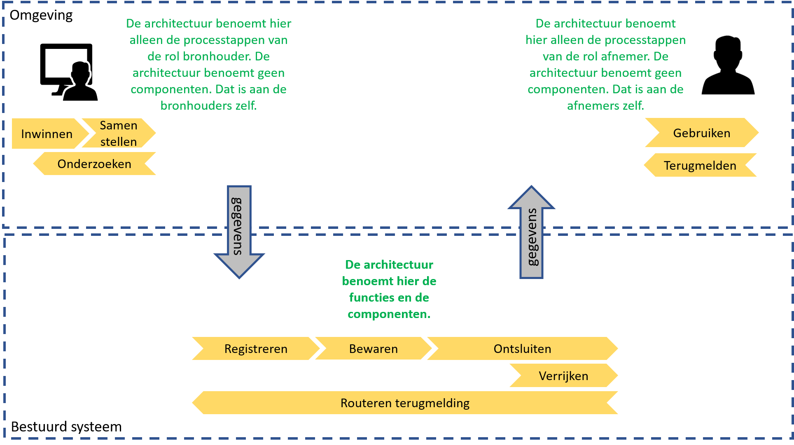
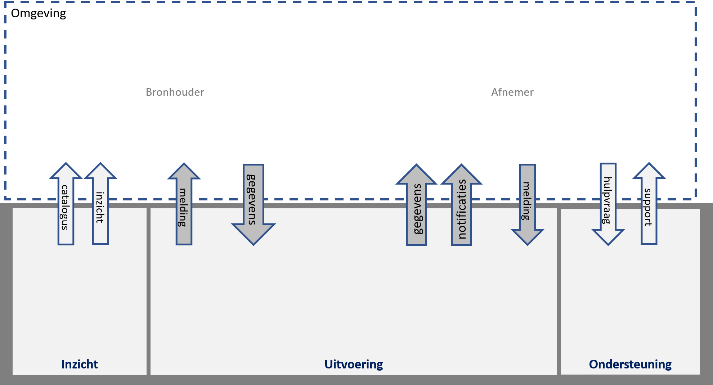

## Afbakening

Dit hoofdstuk beschrijft de afbakening en context van de ICT-voorzieningen voor de Objectenregistratie. Het doel hiervan is de grenzen van deze ICT-voorzieningen en de bijdragen ervan aan de omgeving te bepalen. De afbakening brengt in kaart welke soorten interactie bronhouders en afnemers hebben met de ICT-voorzieningen voor de Objectenregistratie.

### Doel van de Objectenregistratie

Voor de Architectuurbeschrijving van de ICT-voorzieningen voor de Objectenregistratie is het goed het doel van de registratie te kennen. In de [beleidsvisie voor de samenhangende objectenregistratie](https://www.geobasisregistraties.nl/documenten/beleidsnota/2019/11/29/beleidsvisie-samenhangende-objectenregistratie) is een vijftal doelstellingen geformuleerd:

1. Een betrouwbare, consistente en actuele samenhangende gegevensset voor heel Nederland;
2. Een efficiëntere inwinning en bijhouding van objecten, ook in drie dimensies (3D);
3. Een betere inpassing in moderne architecturen;
4. Meer en eenvoudiger gebruik van deze informatie in maatschappelijke toepassingen. De registratie gedraagt zich voor de gebruiker als één registratie.
5. De objectenregistratie maakt onderdeel uit van een robuuste geo-informatie infrastructuur binnen de generieke digitale infrastructuur en voldoet aan de [12 eisen voor een basisregistratie](https://www.digitaleoverheid.nl/overzicht-van-alle-onderwerpen/gegevens/naar-een-gegevenslandschap/themas/twaalf-eisen-stelsel-van-basisregistraties/)

### Context voor de Architectuurbeschrijving

Onderstaande afbeelding toont de globale processtappen rond de Objectenregistratie. *Bronhouders* zorgen voor het **inwinnen** van bronmateriaal zoals luchtfoto's of bouwwerkinformatiemodellen of maken gebruik van door anderen ingewonnen bronmateriaal. Op basis van dit bronmateriaal **stelt** de bronhouder objectgegevens **samen** die voldoen aan de eisen van de Objectenregistratie en **registreert** deze objectgegevens in de opslag van de Objectenregistratie waar ze worden **bewaard**. Vanuit de opslag worden gegevens **ontsloten** richting *afnemers* die deze gegevens **gebruiken** in hun (bedrijfs-)processen. 

Regelmatig worden de objectgegevens **verrijkt** voordat ze worden gebruikt, bijvoorbeeld door ze te combineren met andere gegevens uit de objectenregistratie of ze te bewerken tot afgeleide informatie. Bewerkingen zijn: zoeken, selecteren, filteren, combineren en berekenen. Het resultaat van verrijken noemen we *informatieproducten*. Zowel gegevens(producten) als informatie(producten) van de objectenregistratie worden ontsloten via services.

Vanuit de Objectenregistratie worden alleen *generieke* informatieproducten verstrekt. Dat zijn producten die voor een groot deel van de afnemers relevant zijn. Specifieke informatieproducten waar alleen bepaalde sectoren of afnemers behoefte aan hebben vallen buiten de scope van de Objectenregistratie. Als er bij de afnemers twijfel over de juistheid van  gegevens bestaat dan kunnen zij dat **terugmelden** waarna de bronhouder zal **onderzoeken** of die twijfel tot wijzigingen moet leiden.

<figure id="processtappen">
    
    <figcaption>De globale processtappen van de samenhangende objectenregistratie</figcaption>
</figure>

Samenvattend onderscheiden we de volgende processtappen.

| Processtap | Omschrijving | 
|---|---|
| **Inwinnen** | Het door waarneming vanuit de werkelijkheid of uitvraag aan burgers en bedrijven vanuit werkprocessen beschikbaar maken van gegevens over objecten en/of eigenschappen daarvan in een gegevensbron. |
| **Samenstellen**  | Het combineren van vanuit verschillende gegevensbronnen afkomstige ruwe of getransformeerde gegevens over objecten en/of eigenschappen daarvan tot een samenhangende beschrijving conform hetgeen daarover is bepaald in inhoudelijke criteria en kwaliteitseisen. |
| **Registreren** | Het op een gevalideerde wijze vastleggen van gegevens over objecten en/of eigenschappen daarvan in de registratie |
| **Bewaren** | Het duurzaam beschikbaar houden van de gegevens over objecten en/of eigenschappen daarvan in de registratie. |
| **Ontsluiten** | Het beschikbaar stellen van de in de registratie opgenomen gegevens op een zodanige wijze dat deze als gegevens eenvoudig door afnemers kunnen worden benaderd. |
| **Verrijken** | Het zodanig transformeren of presenteren van in de registratie opgenomen gegevens dat een op afnemersbehoeften afgestemd informatieproduct ontstaat. |
| **Gebruiken** | Het ophalen van de beschikbaar gestelde gegevens en de toepassing daarvan binnen de werkprocessen waarvoor de gegevens zijn benodigd. |
| **Terugmelden** | Het doorgeven van een mogelijk onjuist in de registratie opgenomen gegeven aan de bronhouder met daarbij een voldoende onderbouwing van de mogelijke onjuistheid om een onderzoek mogelijk te maken. |
| **Onderzoeken** | Het analyseren van een mogelijke onjuistheid in de registratie naar aanleiding van een door een afnemer doorgegeven signaal en het na het verzamelen van aanvullende gegevens al dan niet wijzigen van het betreffende gegeven in de registratie. |

### Scope van de Architectuurbeschrijving
Op basis van de processtappen is de scope van de Architectuurbeschrijving te bepalen. Onderstaande afbeelding geeft deze scope weer. In deze afbeelding is onderscheid gemaakt tussen besturing, bestuurd systeem en omgeving. 

<figure id="scopearchitectuur processen">
    
    <figcaption>Scope van de architectuurbeschrijving.</figcaption>
</figure>

Deze architectuurbeschrijving heeft als scope de ICT-voorzieningen voor **de uitvoering en ook de ondersteuning van de Samenhangende Objectenregistratie**. Dit betreft de processtappen **Registeren, Bewaren, Ontsluiten, (Generiek) Verrijken** en de bijbehorende ondersteundende processen. Alleen het verrijken van gegevens tot generieke informatieproducten behoort tot de scope van (de ICT-voorzieningen voor) de Objectenregistratie. Deze architectuurbeschrijving benoemt binnen de scope de functies, componenten en samenhang. Voor de processen van de rollen bronhouder en afnemer benoemt de architectuurbeschrijving alleen de processtappen. De benoeming van de ICT-componenten en de inrichting daarvan is aan de bronhouders en afnemers zelf en daarmee buiten de scope van deze architectuurbeschrijving

### Interacties met de omgeving

De Objectenregistratie heeft de volgende interactie met de omgeving.

<figure id="scopearchitectuur interacties">
    
    <figcaption>Interacties</figcaption>
</figure>

| Actor          | Interacties | 
|----------------|-------------|
| **Bronhouder** | **Gegevens**. De bronhouder registreert en beheert objectgegevens. |
|                | **Meldingen**: De bronhouder verwerkt terugmeldingen van afnemers. |
|                | **Catalogus**. De bronhouder gebruikt de gegevens- en dienstencatalogus om kennis te nemen van de gegevensdefinities en diensten van de Objectenregistratie. |
|                | **Inzicht**. De bronhouder gebruikt inzicht in de gegevenskwaliteit ter ondersteuning van het beheren van objectgegevens. |
|                | **Support**. De bronhouder ontvangt ondersteuning bij het gebruik van de Objectenregistratie. |
|                | **Hulpvraag**. De bronhouder kan om ondersteuning vragen bij het gebruik van de Objectenregistratie. |
| **Afnemer**    | **Gegevens**. De afnemer neemt objectgegevens en generieke informatieproducten af. |
|                | **Meldingen**. De afnemer levert terugmeldingen bij twijfel over de juistheid van de objectgegevens. |
|                | **Catalogus**. De afnemer gebruikt de gegevens- en dienstencatalogus om kennis te nemen van de gegevensdefinities en diensten van de Objectenregistratie. |
|                | **Inzicht**. De afnemer gebruikt inzicht in de gegevenskwaliteit ter ondersteuning van het gebruiken van objectgegevens. |
|                | **Support**. De afnemer (mens of computer) ontvangt ondersteuning bij het gebruik van de Objectenregistratie. |
|                | **Hulpvraag**. De afnemer kan om ondersteuning vragen bij het gebruik van de Objectenregistratie. Hier wordt zowel geautomatiseerde ondersteuning als menselijke ondersteuning bedoeld.|

De actor Bronhouder in de omgeving maakt gebruik van diensten van de Objectenregistratie om objectgegevens te registreren. 
De actor Afnemer in de omgeving maakt gebruik van de diensten van de Objectenregistratie om objectgegevens af te nemen.

Bronhouders en afnemers maken gebruik van ondersteuners zoals dienstenleveranciers en softwareleveranciers en kunnen taken uitbesteden aan derden, zoals samenwerkingsverbanden en gegevensleveranciers.
De beschreven interacties hebben deels ook betrekking op deze ondersteuners. Zo zullen softwareleveranciers ook gebruik maken van de gegevens- en de dienstencatalogus van de Objectenregistratie.

     Voor reviewers: De interacties komen overeen met de pijlen in de afbeelding. 
     Opmerkingen op de tabel en op de afbeeldingen zijn in samenhang welkom.

De Besturing van de Objectenregistratie ontvangt informatie uit het systeem en uit de omgeving. 
Op basis van die informatie wordt sturing gegeven aan het systeem en aan de omgeving. 
Deze interacties worden in deze versie van de architectuur niet verder uitgewerkt. 

