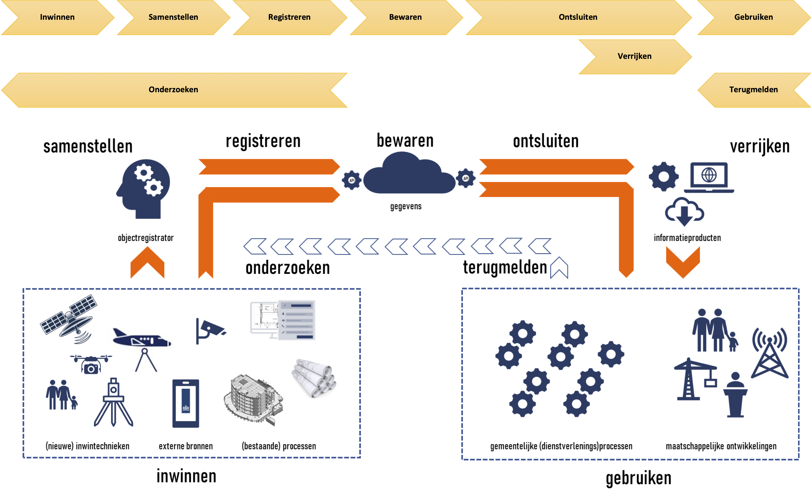

## Afbakening van de Objectenregistratie

Dit hoofdstuk beschrijft de afbakening en context van de Objectenregistratie. Het doel hiervan is de grenzen van de Objectenregistratie en de bijdragen (diensten) aan de omgeving te bepalen. De afbakening brengt in kaart welke rollen en partijen (waaronder bronhouders en afnemers) interactie met de Objectenregistratie hebben en welke soorten interactie er zijn.

### Context van de Objectenregistratie

Onderstaande afbeelding toont de globale werking van de Objectenregistratie. Bronhouders zorgen voor het **inwinnen** van bronmateriaal zoals luchtfoto's of bouwwerkinformatiemodellen of maken gebruik van door andere ingewonnen bronmateriaal. Op basis van dit bronmateriaal **stelt** de bronhouder objectgegevens **samen** die voldoen aan de eisen van de Objectenregistratie en **registreert** deze objectgegevens in de opslag van de Objectenregistratie waar ze worden **bewaard**. Vanuit de opslag worden gegevens **ontsloten** richting afnemers die deze gegevens **gebruiken** in hun (bedrijfs-)processen. Regelmatig worden de objectgegevens **verrijkt** voordat ze worden gebruikt, bijvoorbeeld door ze te combineren met gegevens uit andere bronnen. Het resultaat van verrijken noemen we informatieproducten. Vanuit de Objectenregistratie worden alleen generieke informatieproducten verstrekt. Dat zijn generieke producten die voor een groot deel van de afnemers relevant zijn. Specifieke informatieproducten waar bepaalde sectoren of afnemers behoefte aan hebben vallen buiten de scope van de Objectenregistratie. Als er bij de afnemers twijfel over de juistheid van de gegevens bestaat dan kunnen zij dat **terugmelden** waarna de bronhouder zal **onderzoeken** of die twijfel klopt.

<figure id="soreenvoudig">
    
    <figcaption>De globale werking van de Samenhangende objectenregistratie</figcaption>
</figure>

Samenvattend onderscheiden we de volgende processtappen.

| Processtap | Omschrijving | 
|---|---|
| Inwinnen | Het door waarneming vanuit de werkelijkheid of uitvraag aan burgers en bedrijven vanuit werkprocessen beschikbaar maken van gegevens over objecten en/of eigenschappen daarvan in een gegevensbron |
| Samenstellen  | Het combineren van vanuit verschillende gegevensbronnen afkomstige ruwe of getransformeerde gegevens over objecten en/of eigenschappen daarvan tot een samenhangende beschrijving conform hetgeen daarover is bepaald in inhoudelijke criteria en kwaliteitseisen |
| Registreren | Het op een gevalideerde wijze vastleggen van gegevens over objecten en/of eigenschappen daarvan in de registratie |
| Bewaren | Het duurzaam beschikbaar houden van de gegevens over objecten en/of eigenschappen daarvan in de registratie |
| Ontsluiten | Het beschikbaar stellen van de in de registratie opgenomen gegevens op een zodanige wijze dat deze als gegevens eenvoudig door afnemers kunnen worden benaderd |
| Verrijken | Het zodanig transformeren of presenteren van in de registratie opgenomen gegevens dat een op afnemersbehoeften afgestemd informatieproduct ontstaat |
| Gebruiken | Het ophalen van de beschikbaar gestelde gegevens en de toepassing daarvan binnen de werkprocessen waarvoor de gegevens zijn benodigd |

Onderstaande afbeelding geeft deze processtappen weer in de globale werking van de Objectenregistratie.

<figure id="soreenvoudigprocesstappen">
    
    <figcaption>De processtappen in de globale werking van de Samenhangende objectenregistratie</figcaption>
</figure>

     WB: bovenstaande processtappen zijn gebaseerd op de stand van zaken mbt de organisatie van de SOR op 29 mei 2020

### Stelselrollen

Ronde de Objectenregistratie zijn de volgende stelselrollen te onderkennen.

| Stelselrol | Omschrijving | 
|---|---|
| Bronhouder | Verantwoordelijkheid voor verzamelen en registratie van gegevens op basis van eigen en andere gegevensbronnen conform de gestelde inhoudelijke voorschriften en kwaliteitseisen |
| Verstrekker | Verantwoordelijkheid voor levering van gegevens uit de registratie (met de daarbij behorende ondersteuning) en de levering van enkele generieke informatieproducten aan afnemers |
| Afnemer| Verantwoordelijkheid voor al dan niet verplicht gebruik van gegevens in de eigen processen |
| Toezichthouder | Verantwoordelijkheid voor toezicht op het in overeenstemming met eisen, afspraken en wetgeving opereren van de gehele keten rondom de registratie |
| Beleidsverantwoordelijke| Verantwoordelijkheid voor het organiseren van een gezamenlijke systeemsturing op de registratie |

N.B. De rol van attribuutbeheerder zal nog nader moeten worden gepositioneerd.

     WB: bovenstaande stelselrollen zijn gebaseerd op de stand van zaken mbt de organisatie van de SOR op 29 mei 2020, muv Beleidsverantwoordelijke waarvoor in die versie Eigenaar wordt gehanteerd.

### Scope van de Architectuurbeschrijving
Op basis van de processtappen en stelselrollen is de scope van de Architectuurbeschrijving te duiden. Onderstaande afbeelding geeft dat weer op basis van het besturingsparadigma van de Leeuw. Dit besturingsparadigma maakt onderscheid  tussen een systeem bestaande uit een besturend orgaan en een bestuurd systeem en de omgeving van het systeem. In onderstaande afbeelding is in het bestuurd systeem ook nog onderscheid gemaakt tussen uitvoering en ondersteuning. Onder uitvoering verstaan we hier het inwinnen, samenstellen, registreren, bewaren, ontsluiten, verrijken en gebruiken van objectgegevens. Deze processtappen vallen deels binnen en deels buiten de scope van de Architectuurbeschrijving.

<figure id="scopearchitectuur1">
    
    <figcaption>Scope van de Architectuurbeschrijving</figcaption>
</figure>

     WB: De afbakening van de processtappen en stelselrollen is nog in ontwikkeling. Bovenstaande afbekening toont een mogelijke variant.

De Architectuurbeschrijving heeft als scope de ICT-voorzieningen voor de uitvoering en de ondersteuning van de Samenhangende Objectenregistratie. In de hier getoonde afbakening betreft dit de processtappen **Registeren, Bewaren, Ontsluiten en Verrijken** en de bijbehorende ondersteundende processen. Alleen het verrijken tot generieke informatieproducten behoort tot de Objectenregistratie.

De Architectuurbeschrijving benoemt binnen de scope de capabilities, componenten en samenhang en de benodigde standaarden. Voor de processen van de rollen bronhouder en afnemer, benoemt de Architectuurbeschrijving alleen de capabilities. De componenten en de inrichting daarvan is aan de bronhouders en afnemers zelf.

### Interacties met de partijen in de omgeving

De Objectenregistratie heeft de volgende interactie met partijen in de omgeving.

| Partij | Interacties | 
|--------|-------------|
| Bronhouder | Objectgegevens. De bronhouder registreert objectgegevens |
|  | **Terugmeldingen**: De bronhouder verwerkt terugmeldingen van Afnemers |
|  | Correctieverzoeken. De bronhouder verwerkt correctieverzoeken van betrokkenen. Betrokken zijn personen waar de objectgegevens betrekking op hebben. Dat zou bijvoorbeeld de eigenaar van een gebouw kunnen zijn. Betrokken zijn niet per se ook Afnemer. Daarom maken we onderscheid tussen Terugmeldingen en Correctieverzoeken |
|  | Catalogus. De bronhouder gebruikt de gegevens- en de dienstencatalogus om kennis te nemen van de gegevensdefinies en van de diensten van de Objectenregistratie |
|  | Support (of Hulp of Ondersteuning). De bronhouder ontvangt ondersteuning bij het gebruik van de Objectenregistratie |
|  | Hulpvraag. De bronhouder kan om ondersteuning vragen bij het gebruik van de Objectenregistratie |
| Afnemer                  | Objectgegevens. De afnemer neemt objectgegevens en generieke informatieproducten af |
|  | Terugmeldingen. De afnemer levert terugmeldingen bij twijfel over de juistheid van de objectgegevens. |
|  | Catalogus. De afnemer gebruikt de gegevens- en de dienstencatalogus om kennis te nemen van de gegevensdefinies en van de diensten van de Objectenregistratie |
|  | Support (of Hulp of Ondersteuning). De afnemer ontvangt ondersteuning bij het gebruik van de Objectenregistratie |
|  | Hulpvraag. De afnemer kan om ondersteuning vragen bij het gebruik van de Objectenregistratie |
| Betrokkene | Betrokkenen zijn personen waar de objectgegevens betrekking op hebben. Dat zou bijvoorbeeld de eigenaar van een gebouw kunnen zijn. Betrokkenen zijn niet per se ook Afnemer. Daarom maken we onderscheid tussen Betrokkenen en Afnemers en tussen Terugmeldingen en Correctieverzoeken. N.B. De rol Betrokkene is niet opgenomen in de afbeelding |
| Toezichthouder | nog in te vullen |
| Beleidsverantwoordelijke | nog in te vullen |

Alle genoemde partijen maken gebruik van ondersteunende partijen zoals ICT-leveranciers en kunnen ook taken uitbesteden aan derden, zoals gegevensleveranciers. De beschreven interacties hebben deels ook betrekking op ondersteunende partijen. Zo zullen softwareontwikkelaars ook gebruik maken van de gegevens- en de dienstencatalogus van de Objectenregistratie.
