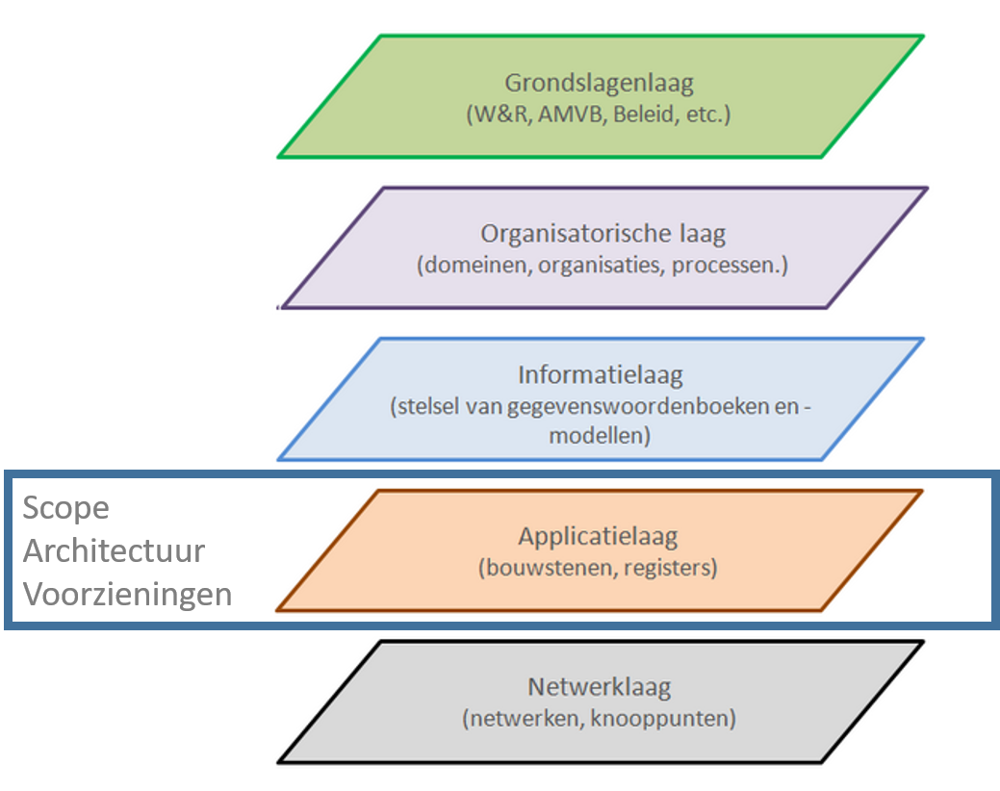
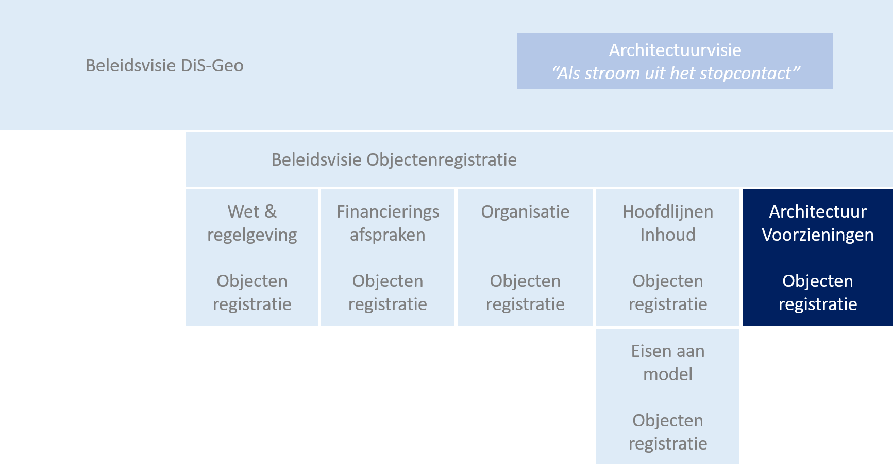

## Inleiding

Een samenhangende objectenregistratie is een uniforme registratie met daarin basisgegevens over objecten in de fysieke werkelijkheid die zich voor gebruikers als één registratie gedraagt. Daaronder verstaan we objecten die in het terrein zichtbaar zijn, zoals gebouwen, wegen, water, spoorlijnen en bomen, terreindelen, aangevuld met enkele (administratieve) objecten als woonplaatsen, gemeentegrenzen en openbare ruimten. In de objectenregistratie gaan in ieder geval de objecten van de basisregistratie adressen en gebouwen (BAG) en de basisregistratie grootschalige topografie (BGT) op. Daarnaast is het de bedoeling dat ook het gedeelte van de WOZ-administratie waarin objectgegevens zijn opgenomen en een aantal basisgegevens uit aanpalende registraties in de objectenregistratie worden opgenomen. Ook zijn er belangrijke raakvlakken met de basisregistratie topografie (BRT) en het Nationaal Wegenbestand (NWB).

Het stelsel van basisregistraties is in Nederland een belangrijke grondlegger voor de informatiehuishouding van de (digitale) overheid. Binnen dit stelsel is een belangrijke plek weggelegd voor de geo- basisregistraties, die informatie bevatten met een locatiecomponent. Meer samenhang tussen deze registraties is gewenst om efficiënte inwinning en bijhouding en integraal gebruik mogelijk te maken. 
Om een integrale doorontwikkeling mogelijk te maken is het Ministerie van BZK de Doorontwikkeling in Samenhang van de geo(basis)registraties (DiS Geo) gestart. Een belangrijke eerste stap daarbinnen is de totstandbrenging van een samenhangende objectenregistratie.

De ontwikkeling van een samenhangende objectenregistratie moet leiden tot de realisatie van de volgende doelen: 
1.	Een betrouwbare, consistente en actuele samenhangende gegevensset voor heel Nederland; 
2.	Een efficiëntere inwinning en bijhouding van objecten, ook in drie dimensies (3D); 
3.	Een betere inpassing in moderne architecturen; 
4.	Meer en eenvoudiger gebruik van deze informatie in maatschappelijke toepassingen. De registratie gedraagt zich voor de gebruiker als één registratie; 
5.	De objectenregistratie maakt onderdeel uit van een robuuste geo-informatie infrastructuur binnen de generieke digitale infrastructuur en voldoet aan de 12 eisen voor een basisregistratie; 

## Dit document

Dit document is de *Architectuurbeschrijving Voorzieningen* van de Samenhangende Objectenregistratie. Het beschrijft de afbakening, de ICT-inrichtingsprincipes en de conceptuele of functionele inrichting (de functionele onderdelen en samenhang) van de ICT-componenten voor de Samenhangende Objectenregistratie. Met andere woorden, de Architectuurbeschrijving Voorzieningen beschrijft de Objectenregistratie op de Applicatielaag, laag 4 in het [NORA-vijflaagsmodel](https://www.noraonline.nl/wiki/Vijflaagsmodel)

<figure id="scope in nora5laagsmodel">
    
    <figcaption>Scope in het NORA 5 laagsmodel</figcaption>
</figure>

### Doel en doelgroep

De Architectuurbeschrijving moet het mogelijk maken om  keuzes te maken voor de verdere inrichting van de ICT-voorzieningen (componenten, applicaties of systemen) voor de Samenhangende Objectenregistratie. Ook moet de Architectuurbeschrijving het mogelijk maken om de transitiestrategie te bepalen voor de overgang van de huidige voorzieningen van o.a. de BAG, BGT en BRT naar de ICT-componenten voor de Objectenregistratie. Tot slot moet de Architectuurbeschrijving het mogelijk maken om de technische en organisatorische inrichting voor de ICT-voorzieningen voor de Objectenregistratie te bepalen. De onderscheiden functies (capabilities, "wat moet kunnen") binnen het systeem worden zodanig beschreven dat een opdracht om deze verder uit te werken inhoudelijk voldoende duidelijk is voor opdrachtgever en opdrachtnemer.

De Architectuurbeschrijving geeft richting aan de nadere inrichting van de ICT-componenten voor de Objectenregistratie en is daarom met name bedoeld voor degenen die betrokken zijn bij die inrichting. Daarnaast is de Architectuurbeschrijving van belang voor de afstemming over de inrichting van de ICT-voorzieningen voor de Objectenregistratie met alle belanghebbenden: beleidsverantwoordelijke(n), bronhouders, verstrekker(s), afnemers, beheerders en (software-)leveranciers en andere belanghebbenden.

### Leeswijzer

De Architectuurbeschrijving van de Samenhangende Objectenregistratie heeft de volgende opbouw:

Het hoofdstuk [Afbakening](#afbakening) beschrijft de grenzen van de Objectenregistratie en de interactie met de omgeving. De afbakening brengt in kaart welke rollen en partijen (waaronder bronhouders en afnemers) interactie met de ICT-voorzieningen van de Objectenregistratie hebben en welke soorten interactie er zijn.

Het hoofdstuk [ICT-inrichtingsprincipes](#ict-inrichtingsprincipes) beschrijft de principes die bepalend zijn voor de functionele en deels ook technische inrichting van de ICT-voorzieningen en de bijbehorende ICT-organisatie van de Objectenregistratie.  

Het hoofdstuk [Inrichting](#inrichting) beschrijft de conceptuele inrichting van de ICT-voorzieningen van de Objectenregistratie op de applicatielaag van het NORA-vijflaagsmodel.

Het hoofdstuk [Uitwerking](#uitwerking) werkt de ICT-onderdelen van de Objectenregistratie verder uit, vormt het kader voor de technische inrichting en biedt een gedeelte van de basis voor de organisatorische inrichting rond de ICT-voorzieningen.

Relevante bijlagen staan in het hoofdstuk [Bijlagen](#bijlagen-principes)

     Voor reviewers: In groene kaders stellen de auteurs soms een vraag. In jullie reviewcommentaar lezen we graag antwoorden.

### Context

Dit document is een product van een samenwerking van Geonovum, Kadaster, Ministerie van BZK en VNG Realisatie. Bij de totstandkoming zijn diverse belanghebbenden betrokken. Afstemming met een bredere groep belanghebbende organisaties is nodig, met name om de samenhang met het gehele stelsel van basisregistraties te borgen. 

Deze Architectuurbeschrijving Voorzieningen van de Samenhangende Objectenregistratie mag gelezen worden in samenhang met de volgende  documenten in de context. 

<figure id="documentenstructuur">
    
    <figcaption>Documenten van de samenhangende objectenregistratie</figcaption>
</figure>

Globale uitgangspunten voor het programma DiS-Geo worden vastgelegd in een nog te verschijnen beleidsvisie DiS Geo.

De architectuurvisie van het programma DiS-Geo is beschreven in een [houtskoolschets](https://www.geobasisregistraties.nl/documenten/publicatie/2020/07/16/houtskoolschets-architectuurvisie-dis-geo) "Geodata als stroom uit het stopcontact".

Globale uitgangspunten voor het gegevensmodel, de voorziene processen voor inwinning, registratie en ontsluiting van gegevens, en eerste beelden over de organisatie en governance en financiering zijn vastgelegd in een [beleidsvisie samenhangende objectenregistratie](https://www.geobasisregistraties.nl/documenten/beleidsnota/2019/11/29/beleidsvisie-samenhangende-objectenregistratie) die eind 2019 door het BAG BAO en de Regieraad BGT is vastgesteld.

Sindsdien wordt er gewerkt aan een verdere invulling van een drietal onderwerpen, die samenvallen met drie van de vijf lagen uit het [NORA-vijflaagsmodel](#nora5laagsmodel):

Een uitwerking van de governance, organisatie en financiering van een samenhangende objectenregistratie, bestaande uit onder meer een beschrijving van taken en verantwoordelijkheden, de inrichting van de besluitvormingsstructuur, financieringsafspraken en een eerste opzet van ketenprocessen (organisatorische laag / laag 2 uit het NORA-vijflaagsmodel). Hiervan zijn op dit moment nog geen documenten beschikbaar.

Een uitwerking van de inhoud van een samenhangende objectenregistratie, bestaande uit onder meer inhoudelijke uitgangspunten, de invulling van een aantal generieke onderwerpen die van belang zijn voor de informatiemodellering en een conceptuele beschrijving van de begrippen (soorten objecten), de eigenschappen die daarvan worden vastgelegd en de waarden die deze eigenschappen kunnen aannemen (informatielaag / laag 3 uit het NORA-vijflaagsmodel). Er is een [hoofdlijnenrapport](https://docs.geostandaarden.nl/disgeo/hiso/) beschikbaar.   

Een uitwerking van de architectuurbeschrijving van de ICT-voorzieningen voor een samenhangende objectenregistratie, bestaande uit een afbakening van de systeembegrenzing, ICT-inrichtingsprincipes en een uitwerking van de functionele onderdelen van de ICT-voorzieningen en hun onderlinge samenhang (applicatielaag / laag 4 uit het NORA-vijflaagsmodel). Het document dat u nu leest is hiervan een versie.

