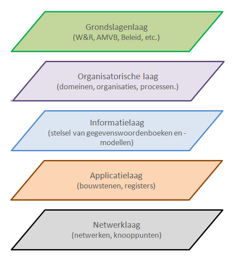

## Inleiding

Dit is de *Architectuurbeschrijving* van de Samenhangende Objectenregistratie. Het beschrijft de afbakening, de inrichtingsprincipes en de conceptuele inrichting (de onderdelen en samenhang) van de Samenhangende Objectenregistratie. De Architectuurbeschrijving beschrijft de Objectenregistratie op de Applicatielaag, laag 4 in het [NORA-vijflaagsmodel](https://www.noraonline.nl/wiki/Vijflaagsmodel)

<figure id="nora5laagsmodel">
    
    <figcaption>Het NORA 5 laagsmodel</figcaption>
</figure>

### Toepassingsgebied

De Architectuurbeschrijving moet het mogelijk maken om richtinggevende keuzes te maken voor de verdere inrichting van de ICT-voorzieningen (of applicaties of systemen) voor de Samenhangende Objectenregistratie. Ook moet de Architectuurbeschrijving het mogelijk maken om de transiteistrategie te bepalen voor de overgang van de huidige voorzieningen van o.a. de BAG en de BGT naar de voorzieningen voor de Objectenregistratie. Tot slot moet de Architectuurbeschrijving  het ook mogelijk maken om de technische inrichting van de Objectenregistratie te kunnen bepalen. 

### Doelgroep

De Architectuurbeschrijving geeft richting aan de inrichting van de Objectenregistratie en is daarom met name bedoeld voor degenen die betrokken zijn bij die inrichting. Daarnaast is de Architectuurbeschrijving van belang voor de afstemming over de inrichting van de Objectenregistratie met alle belanghebbenden: beleidsverantwoordelijke, bronhouders, verstrekker, afnemers, beheerders en (software-)leveranciers.

### Leeswijzer

De Architectuurbeschrijving van de Samenhangende Objectenregistratie heeft de volgende opbouw:

Het hoofdstuk [Afbakening van de Objectenregistratie](#afbakening-van-de-objectenregistratie) beschrijft de grenzen van de Objectenregistratie en de bijdragen (diensten) ervan aan de omgeving. De afbakening brengt in kaart welke rollen en partijen (waaronder bronhouders en afnemers) interactie met de Objectenregistratie hebben en welke soorten interactie er zijn.

Het hoofdstuk [Inrichtingsprincipes voor de Objectenregistratie](#inrichtingsprincipes-voor-de-objectenregistratie) beschrijft de principes die bepalend zijn voor de inrichting van de ICT-voorzieningen van de Objectenregistratie.  

Het hoofdstuk [Inrichting van de Objectenregistratie](#inrichting-van-de-objectenregistratie) beschrijft de conceptuele inrichting van de ICT-voorzieningen van de Objectenregistratie op de applicatielaag van het NORA-vijflaagsmodel. Het vormt het kader voor technische inrichting van de Objectenregistratie en biedt een basis voor de organisatorische inrichting rond de ICT-voorzieningen.

Tenslotte worden in het hoofdstuk [Conlusies en Aanbevelingen](#conclusies-en-aanbevelingen) de belangrijkste conclusies en de belangrijkste aanbevelingen op een rijtje gezet.

     WB: wat mij betreft heeft de Architectuurbeschrijving geen hoofdstuk 'Conclusies en Aanbevelingen'.

Relevante bijlagen staan in het hoofdstuk [Bijlagen](#bijlagen)

     WB: wat mij betreft nemen we in de bijlagen niet alle mogelijk relevante principes op uit andere bronnen, maar verwijzen we naar die bronnen (als de bron echt relevant blijkt te zijn). In de bijlagen kunnen we wel onze 'verantwoording' naar principes van andere opnemen als dat zinvol is.

### Het proces

De Architectuurbeschrijving van de Samenhangende Objectenregistratie is een product van een samenwerking van Geonovum, het Kadaster, het ministerie van BZK en de VNG. Bij de totstandkoming zijn diverse belanghebbenden betrokken via een denktank en een klankbordgroep.

