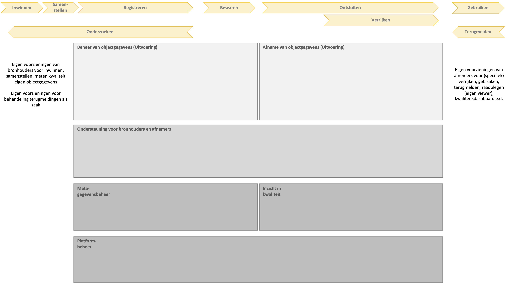
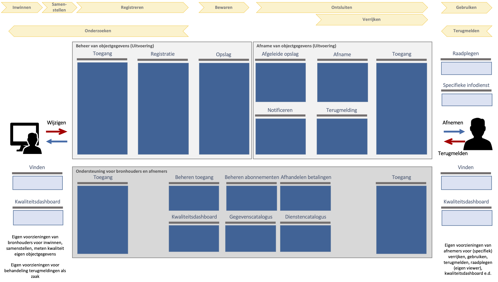
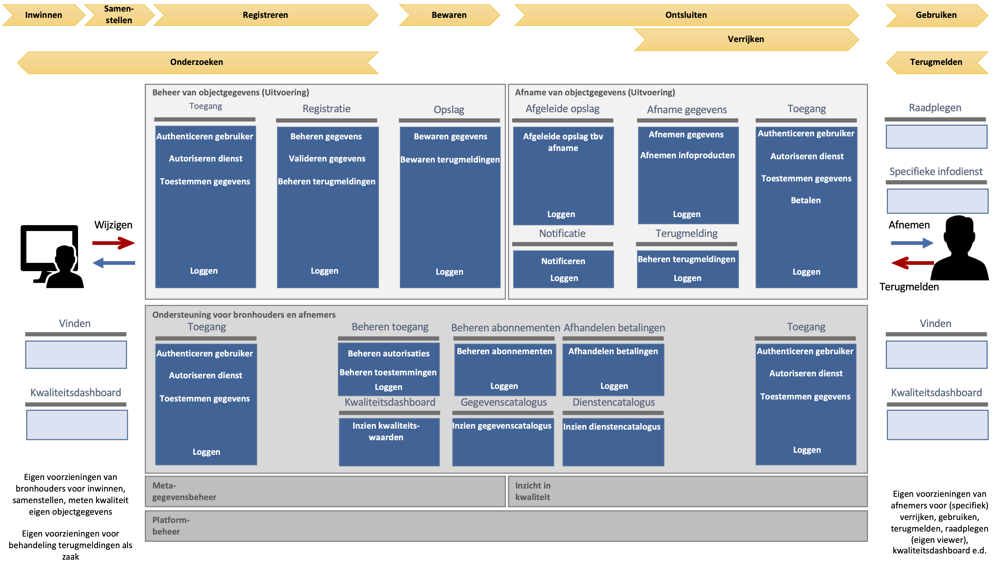

## Inrichting van de Objectenregistratie

     WB: Dit hoofdstuk heb ik deels aangepast en moet nog verder worden uitgewerkt. 

### Inleiding

Dit hoofdstuk beschrijft de functionele of conceptuele inrichting van de Samenhangende Objectenregistratie op de applicatielaag van het NORA-vijflaagsmodel. Het doel hiervan is om sturing te kunnen geven aan de transitie naar de Objectenregistratie. Het vormt het kader voor technische inrichting van de Objectenregistratie en biedt een basis voor de organisatorische inrichting ervan. 

Het beschrijft de functies van de Objectenregistratie. Het beschrijft de onderdelen of componenten van de Objectenregistratie en de verbindingen daartussen en het wijst de functies van de Objectenregistratie toe aan deze onderdelen.  Het beschrijft de benodigde standaarden voor de Objectenregistratie. Het  beschrijft ook de relatie met de inhoud van de Objectenregistratie (op de gegevenslaag van het NORA vijflaagsmodel). Het doel van is ook om de technische inrichting van de Objectenregistratie te kunnen bepalen.

### Functionele lagen in de inrichting

We onderscheiden een viertal lagen in de functionele inrichting van de Objectenregistratie, zoals de afbeelding hieronder toont.

<figure id="inrichtinglagen">
    
    <figcaption>Lagen in de inrichting van de Objectenregistratie</figcaption>
</figure>

Lagen:
- Uitvoering: functies voor het beheren en afnemen van objectgegevens
- Ondersteuning voor bronhouders en afnemers: functies ter ondersteuning van bronhouders en afnemers
- Metagegevensbeheer en Inzicht in kwaliteit
	- Metagegevensbeheer: functies voor het beheren van het informatiemodel, de gegevensregels en de catalogi van gegevenssoorten en diensten
	- Inzicht in kwaliteit: functies voor het bieden van inzicht in kwaliteit van de objectgegevens
- Platformbeheer: functies voor het beheer van de platformen voor de bovenliggende lagen 

### Functies in de lagen Uitvoering en Ondersteuning

De lagen Uitvoering en Ondersteuning bevatten de functies voor: 1) het beheren en afnemen van objectgegevens en 2) ondersteuning van bronhouders en afnemers. Onderstaande afbeelding toont de clusters van functionaliteiten op deze lagen.

<figure id="inrichtinguitvoeringondersteuning">
    
    <figcaption>De capability-clusters op de lagen Uitvoering en Ondersteuning</figcaption>
</figure>

Onderstaande afbeelding toont de functionaliteiten per cluster op deze twee lagen.

<figure id="functiesuitvoeringondersteuning">
    
    <figcaption>De capabilities op de lagen Uitvoering en Ondersteuning</figcaption>
</figure>

### Functies in de laag Meta-gegevensbeheer en Inzicht in kwaliteit

### Functies in de laag Platformbeheer

### Componenten en samenhang

(waaronder de landelijke en bronhouderonderdelen)

### Benodigde standaarden

### Relatie met de inhoud van de Objectenregistratie

Op de gegevenslaag van het NORA vijflaagsmodel