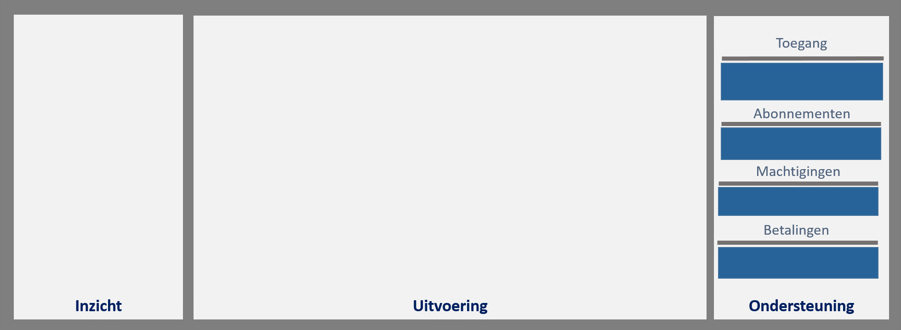

## Inrichting

### Inleiding

Dit hoofdstuk beschrijft de functionele inrichting van de Samenhangende Objectenregistratie op de applicatielaag van het NORA-vijflaagsmodel. Het doel ervan is om sturing te kunnen geven aan de transitie naar de Objectenregistratie en te dienen als kader voor technische inrichting van de Objectenregistratie. Ook biedt het een deel van de basis voor de organisatorische inrichting van de Objectenregistratie. 

Dit hoofdstuk beschrijft de onderdelen van de Objectenregistratie en de verbindingen daartussen en het wijst de functies van de Objectenregistratie toe aan deze onderdelen. 

### Functionele lagen in de inrichting

We onderscheiden drie lagen in de functionele indeling van de Objectenregistratie, zoals de afbeelding hieronder toont. Daarmee duiden we alleen het doel van de functies en doen we geen uitspraak over de de technische inrichting of de verdeling ervan over verschillende ICT-voorzieningen.

<figure id="inrichtinglagen">
    
    <figcaption>Functionele lagen in de inrichting van de Objectenregistratie</figcaption>
</figure>

De laag **Metabeheer** bevat de functies die nodig zijn voor het beheren en gebruiken van gegevens over de gegevens, te weten Gegevenscatalogus en Gegevenskwaliteit. Gegevenscatalogus bevat de functies die nodig zijn om informatiemodellen en gegevensregels te beheren in catalogi waarmee ontwikkelaars die informatiemodellen en gegevensregels kunnen toepassen in voorzieningen. Gegevenskwaliteit bevat de functies om kwaliteitsindicatoren te beheren en kwaliteitsmetingen te doen teneinde inzicht in de gegevenskwaliteit te verkrijgen.

De **Uitvoeringslaag** bevat de functies die nodig zijn voor het voor het beheren en afnemen van objectgegevens, zoals voor het registreren en wijzigen van gegevens en voor het raadplegen ervan. Op deze laag maken we onderscheid tussen de functies ten behoeve van het beheren van objectgegevens door gebruikers in de rol van bronhouder en het afnemen van objectgegevens door gebruikers in de rol van afnemer. 

De **Ondersteuningslaag** bevat de functies die nodig zijn om bronhouders en afnemers te ondersteunen bij het beheren en afnemen van gegevens, zoals het beheren van machtigingen en het raadplegen van dienstencatalogi.

De functies in de drie lagen voor Metabeheer, Uitvoering en Ondersteuning maken we zichtbaar in een **totaaloverzicht**.

Aan de componenten in de drie lagen voor Metabeheer, Uitvoering en Ondersteuning, bestaan ook **niet-functionele eisen**. Deze benoemen we in algemene zin overkoepelend over de lagen en componenten.

### Functies in de laag Metabeheer

Onderstaande afbeelding toont de clusters van functionaliteiten op de laag Metabeheer. Deze clustering is een functionele indeling, geen technische. Het groepeert functies die bijdragen aan hetzelfde doel.

<figure id="inrichting-metabeheer">
    
    <figcaption>De capabilities op de laag Metabeheer </figcaption>
</figure>
  
Op de laag **Metabeheer** onderkennen we de volgende clusters: **Toegang** en **Gegevenscatalogus** en **Gegevenskwaliteit**. 

- *Toegang*: voor het bewaken en loggen van de toegang van meta-beheerders tot de diensten.
- *Gegevenscatalogus*: voor het inzien van de beschikbare soorten objectgegevens, eigenschappen en relaties en de betekenis daarvan, evenals het uitvoeren van versiemanagement op de catalogus als er sprake is van nieuwe objectgegevens of gegevensregels.
 - *Gegevenskwaliteit*: voor het beheren en gebruiken van de door bronhouders en afnemers en andere betrokkenen (zoals toezichthouder en  beleidsverantwoordelijke) overeengekomen kwaliteitsindicatoren. Tevens voor het beheren en gebruiken van de bijbehorende diensten voor het bepalen van de waarden van de kwaliteitsindicatoren ten behoeve van monitoring van de gegevenskwaliteit, bijvoorbeeld door middel van kwaliteitsdashboards en analyses.

### Functies in de laag Uitvoering

Onderstaande afbeelding toont de clusters van functionaliteiten op de laag Uitvoering. Deze clustering is een functionele indeling, geen technische. Het groepeert functies die bijdragen aan hetzelfde doel.

<figure id="functiesuitvoering">
    
    <figcaption>De capabilities op de laag Uitvoering</figcaption>
</figure>

De laag **Uitvoering** bevat de functies voor het beheren van objectgegevens en voor het afnemen van objectgegevens

Op de Uitvoeringslaag onderkennen we de volgende clusters voor *beheer en afname van objectgegevens*:
- *Toegang*: voor het bewaken en loggen van de toegang van bronhouders en hun gemachtigden tot de beheerdiensten en van afnemers tot de afnamediensten. 
- [Registratie](#registratie): voor het creëren en wijzigen van objectgegevens door bronhouders en hun gemachtigden.
- *Opslag*: voor het duurzaam beschikbaar houden van gegevens over objecten en objecteigenschappen.
- *Afname*: voor het afnemen van objectgegevens op verschillende manieren, variërend van het raadplegen van enkelvoudige gegevens tot afnamen in 'bulk' voor bijvoorbeeld analysedoeleinden.
- *Notificatie*: voor het notificeren van afnemers van voor hen relevante gebeurtenissen (we gebruiken gebeurtenissen hier in brede zin, breder dan alleen gebeurtenissen die de objectgegevens betreffen).
- *Terugmelding*: voor het in staat stellen van afnemers om bij gerede twijfel aan de juistheid van gegevens dit te melden en van bronhouders om meldingen in behandeling te nemen.

### Functies in de laag Ondersteuning

Onderstaande afbeelding toont de clusters van functionaliteiten op de laag Ondersteuning. Deze clustering is een functionele indeling, geen technische. Het groepeert functies die bijdragen aan hetzelfde doel.

<figure id="functiesuitvoeringondersteuning">
    
    <figcaption>De capabilities op de laag Ondersteuning</figcaption>
</figure>

Op de **Ondersteuningslaag** onderkennen we de volgende clusters voor de ondersteuning van bronhouders en hun gemachtigden en afnemers:
- *Toegang*: voor het bewaken en loggen van de toegang van bronhouders en hun gemachigden en afnemers tot de ondersteuningsdiensten.
- *Machtigingen*: voor het beheren van machtigingen voor diensten door bronhouders en afnemers. 
- *Abonnementen*: voor het beheren van abonnementen op notificaties van gebeurtenissen door bronhouders en afnemers. We maken onderscheid tussen gebeurtenissen die betrekking hebben op gegevens (voor bronhouders en afnemers) en  andersoortige gebeurtenissen (die bijvoorbeeld relevant zijn voor ontwikkelaars en beheerders van voorzieningen voor en bij bronhouders en afnemers).  
- *Betalingen*: voor het beheren van betalingen van betaalde diensten door de gebruikers van die diensten, indien sprake is van betaalde diensten. Betalen kan op verschillende manieren worden ingericht, zoals vooraf, bij afname van de dienst of achteraf.
- *Dienstencatalogus:* voor het inzien van de beschikbare diensten voor het beheren en afnemen van gegevens, evenals voor het uitvoeren van versiemanagement op de dienstencatalogus als er sprake is van nieuwe diensten.

### Overzicht
Onderstaande afbeelding toont de functionaliteiten per cluster op de drie lagen. Deze functionaliteiten zijn beschreven in het hoofdstuk [Uitwerking] (#uitwerking).

<figure id="metabeheer-inrichting-uitvoering">
    
    <figcaption>De capabilities op de lagen Metabeheer en Uitvoering en Ondersteuning</figcaption>
</figure>

### Niet-functionele eisen

Vraag aan de reviewers: Welke niet-functionele eisen moeten opgenomen worden in deze Architectuurbeschrijving? Hieronder volgen wat handvatten.

De componenten van de objectenregistratie voldoen aan eisen waarmee invulling gegeven kan worden aan de volgende eisen aan basisgegevens:

  Findable		goed vindbaar

  Accessible		goed toegankelijk

  Interoperable	interoperabel met elkaar en met niet-basisgegevens

  Reusable		goed herbruikbaar

De volgende niet-functionele eisen zijn daarom van toepassing op de ICT-componenten en services: 

[API- en URI-strategie](https://aandeslagmetdeomgevingswet.nl/digitaal-stelsel/aansluiten/standaarden/api-en-uri-strategie/) van het Digitaal Stelsel Omgevingswet.

Voor ICT systemen en componenten waarmee de functies beschikbaar gemaakt worden, zijn niet-functionele eisen van toepassing volgens de ISO25010 standaard:

     Voor **kwaliteit-in-gebruik** van de objectenregistratie zijn eisen van toepassing aangaande effectiviteit, efficiëntie, voldoening, vrijheid van risico en dekking van contexten. 

<figure id="metabeheer-inrichting-uitvoering">
    
    <figcaption>De capabilities op de lagen Metabeheer en Uitvoering en Ondersteuning</figcaption>
</figure>
	 
De eisen aangaande dekking van contexten vertalen de vereiste flexibiliteit van de objectenregistratie als geheel naar de vereiste flexibiliteit van de ICT componenten. Denk hierbij aan de aanpasbaarheid van componenten aan veranderingen in de scope van basisgegevens en de structuur van basisgegevens. 

     Voor **productkwaliteit** van de objectenregistratie zijn eisen van toepassing aangaande functionele geschiktheid, betrouwbaarheid, performance, bruikbaarheid, beveiliging, compatibiiteit, onderhoudbaarheid en overdraagbaarheid. 

<figure id="metabeheer-inrichting-uitvoering">
    
    <figcaption>De capabilities op de lagen Metabeheer en Uitvoering en Ondersteuning</figcaption>
</figure>
	 
De eisen aan compatibiliteit betreffen onder andere de interoperabiliteit. Deze zijn zodanig dat gangbare technologie wordt toegepast waarmee een grote mate van technische interoperabiliteit wordt bereikt. Tegelijk verzekeren de eisen aan interoperabiliteit van systemen dat op niveau van de gegevens ook semantische interoperabiliteit wordt ondersteund.         

