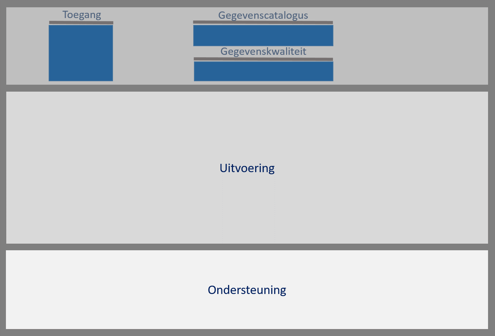
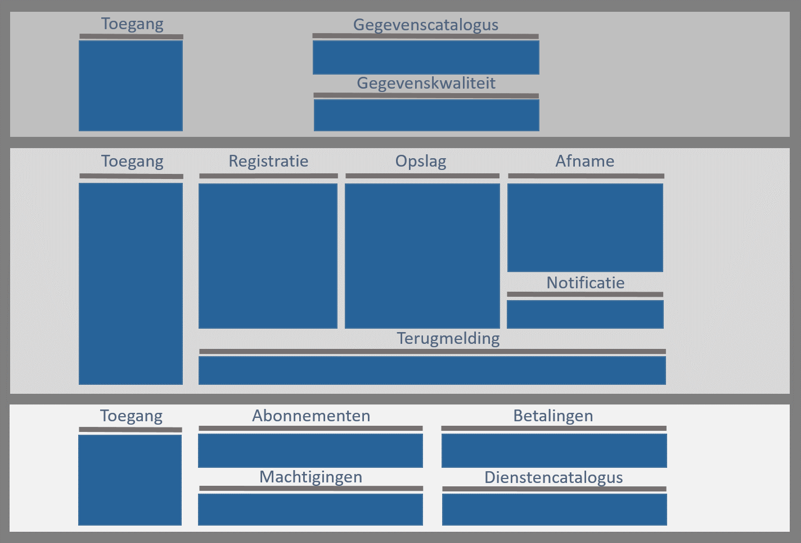

## Inrichting van de Objectenregistratie

### Inleiding

Dit hoofdstuk beschrijft de functionele (of conceptuele) inrichting van de Samenhangende Objectenregistratie op de applicatielaag van het NORA-vijflaagsmodel. Het doel ervan is om sturing te kunnen geven aan de transitie naar de Objectenregistratie en te dienen als kader voor technische inrichting van de Objectenregistratie. Ook biedt het een deel van de basis voor de organisatorische inrichting van de Objectenregistratie. 

Dit hoofdstuk beschrijft de onderdelen (of componenten) van de Objectenregistratie en de verbindingen daartussen en het wijst de functies van de Objectenregistratie toe aan deze onderdelen. 

     Een nadere uitwerking van de onderdelen volgt in het hoofdstuk Uitwerking van onderdelen. Dit wordt toegevoegd parallel aan de review op de afbakening en inrichting.

 

### Functionele lagen in de inrichting

We onderscheiden drie lagen in de functionele indeling van de Objectenregistratie, zoals de afbeelding hieronder toont. Daarmee duiden we alleen het doel van de functies (bijvoorbeeld beheren of afnemen van objectgegevens) en doen we geen uitspraak over de de technische inrichting of de verdeling ervan over verschillende ICT-voorzieningen.

<figure id="inrichtinglagen">
    
    <figcaption>Functionele lagen in de inrichting van de Objectenregistratie</figcaption>
</figure>

De laag **Metabeheer** bevat de functies die betrekking hebben op het beheren van gegevens over de gegevensmeta-data en bestaat uit twee lagen, te weten Meta-gegevensbeheer en 'Inzicht in kwaliteit'. Meta-gegevensbeheer bevat de functies die nodig zijn om informatiemodellen en gegevensregels te beheren evenals het beheren van de gegevenscatalogi om die informatiemodellen en gegevensregels te kunnen toepassen. 'Inzicht in kwaliteit' bevat de functies om kwaliteitsindicatoren te beheren en kwaliteitsmetingen te doen.

     Voor de auteurs, te bespreken: De zinsnede 'De laag Metabeheer bevat de functies die betrekking hebben op het beheren van gegevens over de gegevensmeta-data' begrijp ik niet. Wat is 'het beheren van gegevens over de gegevensmeta-data'. En wat is 'gegevensmeta-data'? Dat kan ik vervangen door datameta-data of gegevensmeta-gegevens en ik weet niet wat dat is. (WB)
	 Dit is een typo, er was eerder geschreven "gegevens over de gegevens (meta-data)" maar de haakjes zijn weggevallen

De **Uitvoeringslaag** bevat de functies die nodig zijn voor het voor het beheren en afnemen van objectgegevens, zoals voor het registreren en wijzigen van gegevens en voor het raadplegen ervan. Op deze laag maken we onderscheid tussen de functies ten behoeve van het beheren van objectgegevens door bronhouders en het afnemen ervan door afnemers van de Objectenregistratie. 

De **Ondersteuningslaag** bevat de functies die nodig zijn om bronhouders en afnemers te ondersteunen bij het beheren en afnemen van gegevens, zoals het beheren van autorisaties en het raadplegen van gegevens- en dienstencatalogi.

Naast de drie lagen voor Metabeheer, Uitvoering en Ondersteuning, is ook functionaliteit nodig in het kader van **Voorzieningenbeheer**. De beheerfuncties voor het beheren van de ICT-voorzieningen op het platform, of de platformen, die het beheren en afnemen van objectgegevens en meta-gegevens mogelijk maken. Deze beheerfuncties maken we zichtbaar in een totaaloverzicht.

### Functies in de laag Metabeheer

Onderstaande afbeelding toont de clusters van functionaliteiten op de laag Metabeheer. Deze clustering is een functionele indeling, geen technische. Het groepeert functies die bijdragen aan hetzelfde doel.

<figure id="inrichting-metabeheer">
    
    <figcaption>De capability-clusters op de laag Metabeheer </figcaption>
</figure>
  
De laag **Metabeheer** bestaat uit de delen **Metagegevensbeheer** en **Inzicht in kwaliteit**. 

Het deel Metagegevensbeheer bevat de volgende clusters aan functionaliteiten:
- *Toegang*: voor het bewaken en loggen van de toegang van meta-beheerders tot de beheerdiensten.
- *Informatiemodel*: voor het beheren van het informatiemodel, de gegevensregels en de bijbehorende gegevens- en dienstencatalogi.

Het deel 'Inzicht in kwaliteit' bevat de volgende clusters aan functionaliteiten:
 - *Toegang*: voor het bewaken en loggen van de toegang van meta-beheerders tot de diensten.
 - *kwaliteitsindicatoren*: voor het beheren van de door bronhouders en afnemers en andere betrokkenen (zoals toezichthouder en  beleidsverantwoordelijke) overeengekomen kwaliteitsindicatoren en bijbehorende diensten
 - *Kwaliteitsmetingen:* Voor het bepalen van de waarden van de kwaliteitsindicatoren ten behoeve van monitoring van de algehele kwaliteit, bijvoorbeeld door middel van analyses

### Functies in de laag Uitvoering

Onderstaande afbeelding toont de clusters van functionaliteiten op de laag Uitvoering. Deze clustering is een functionele indeling, geen technische. Het groepeert functies die bijdragen aan hetzelfde doel.

<figure id="functiesuitvoering">
    
    <figcaption>De capabilities op de laag Uitvoering</figcaption>
</figure>

De laag **Uitvoering** bevat de functies voor het beheren van objectgegevens en voor het afnemen van objectgegevens

Op de Uitvoeringslaag onderkennen we de volgende clusters voor *beheer van objectgegevens*:
- *Toegang*: voor het bewaken en loggen van de toegang van bronhouders en hun gemachtigden tot de beheerdiensten.
- *Registratie*: voor het creëren en wijzigen van objectgegevens door bronhouders en hun gemachtigden.
- *Opslag*: voor het duurzaam beschikbaar houden van gegevens over objecten en objecteigenschappen.

Op de Uitvoeringslaag onderkennen we daarnaast de volgende clusters voor het *afnemen van objectgegevens* :
- *Afgeleide opslag*: voor het beschikbaar maken van gegevens afgestemd op de specifieke behoeften van het afnemen van objectgegevens door grote aantallen afnemers.
- *Afname gegevens*: voor het afnemen van objectgegevens op verschillende manieren, variërend van het raadplegen van enkelvoudige gegevens tot afnamen in 'bulk' voor bijvoorbeeld analysedoeleinden.
- *Notificatie*: voor het notificeren van afnemers van voor hen relevante gebeurtenissen (we gebruiken gebeurtenissen hier in brede zin, breder dan alleen gebeurtenissen die de objectgegevens betreffen)
- *Afname informatie*: voor het afnemen van generieke informatieproducten op verschillende manieren. Het visueel raadplegen van basisgegevens in context (viewer) is zo'n informatieproduct. Ook gecombineerde afname die een afgesproken generieke behoefte van afnemers invult kan zo'n informatieproduct zijn.
- *Terugmelding*: voor het in staat stellen van afnemers om bij gerede twijfel aan de juistheid van gegevens dit te melden.
- *Toegang*: voor het bewaken en loggen van de toegang van afnemers tot de afnamediensten. 

### Functies in de laag Ondersteuning

Onderstaande afbeelding toont de clusters van functionaliteiten op de laag Ondersteuning. Deze clustering is een functionele indeling, geen technische. Het groepeert functies die bijdragen aan hetzelfde doel.

<figure id="functiesuitvoeringondersteuning">
    
    <figcaption>De capabilities op de laag Ondersteuning</figcaption>
</figure>

Op de **Ondersteuningslaag** onderkennen we de volgende clusters voor de ondersteuning van bronhouders en afnemers en hun gemachtigden en leveranciers:
- *Toegang*: voor het bewaken en loggen van de toegang van bronhouders en afnemers tot de ondersteuningsdiensten.
- *Beheer toegang*: voor het beheren van autorisaties op gegevens en diensten door bronhouders en afnemers zelf en eventueel ook door de beheerder van de ICT-voorziening(en).
- *Beheer abonnementen*: voor het beheren van abonnementen op notificaties van gebeurtenissen door bronhouders en afnemers
- *Beheer betalingen*: voor het beheren van de betalingen van betaalde diensten door de gebruikers van die diensten, indien sprake is van betaalde diensten. Betalen kan op verschillende manieren worden ingericht, zoals vooraf, bij afname van de dienst of achteraf.
- *Beheer kwaliteitsdashboard*: voor het inzien van de waarden van kwaliteitsindicatoren per bronhouder of groep van bronhouders (algehele kwaliteit wordt gemeten in de laag Metabeheer, zie onderdeel Inzicht in Kwaliteit)
- *Beheer gegevenscatalogus*: voor het inzien van de beschikbare soorten objectgegevens, eigenschappen en relaties en de betekenis daarvan, evenals het uitvoeren van versiemanagement op de catalogus als er sprake is van nieuwe objectgegevens of gegevensregels (vanuit metagegegevensbeheer)
- *Dienstencatalogus:* voor het inzien van de beschikbare gegevensproducten en diensten voor het beheren en afnemen ervan, evenals voor het uitvoeren van versiemanagement op de dienstencatalogus als er sprake is van nieuwe diensten zoals gegevensdiensten (dataservices), informatiediensten (afname informatie) of abonnementsdiensten op notificaties 

     Voor de auteurs, te bespreken: waarom is het 'Beheer kwaliteitsdashboard' en 'Beheer gegevenscatalogus'? Bij beide is beschreven dat deze functies zijn 'voor het inzien ...'. Dat is geen 'beheer'. 
	 BJ Opnemen bij Beheer gegevenskwaliteit en Beheer standaarden.

     We maken onderscheid tussen abonnementen op notificaties van gebeurtenissen die betrekking hebben op gegevens (voor bronhouders en afnemers) en abonnementen op notificaties van andersoortige gebeurtenissen (bijvoorbeeld ontwikkelingen die relevant zijn voor ontwikkelaars en beheerders van ICT-voorzieningen voor en bij bronhouders en afnemers)  
	 BJ: Hoe worden andersoortige gebeurtenissen bekend bij de notificator?

### Overzicht
Onderstaande afbeelding toont de functionaliteiten per cluster op de drie lagen. Deze functionaliteiten zijn beschreven in het hoofdstuk Uitwerking van onderdelen.

<figure id="metabeheer-inrichting-uitvoering">
    
    <figcaption>De capability-clusters op de lagen Metabeheer en Uitvoering en Ondersteuning</figcaption>
</figure>
  

     Het hoofdstuk "Uitwerking van onderdelen" met de detail beschrijving van de functionaliteiten per cluster zal worden opnemen in de volgende versie van de architectuurbeschrijving.  

### Functies in de aparte architectuurlaag Voorzieningenbeheer

    Voor de auteurs, te bespreken: Moet deze paragraaf niet vervallen. Het is nog afkomstig uit versie 0.4.1 van de architectuurbeschrijving. (WB) 
	Eens (BJ)	 

 

De laag Voorzieningenbeheer bevat de volgende clusters aan functionaliteiten:
 - *Toegang*: voor het bewaken en loggen van de toegang van voorzieningingenbeheerders.
 - *Autorisatievormen*: voor het beheren van de beschikbare autorisatievormen.
 - *Abonnementsvormen*: voor het beheren van de beschikbare abonnementsvormen.
 - *Betalingsvormen*: voor het beheren van de beschikbare betalingsvormen.
 - *Dienstvormen*: voor het beheren van de beschikbaren dienstvormen.
 - *Metingen*: voor het uitvoeren van metingen en raadplegen van uitgevoerde metingen en beschikbaar meetgegevens, zoals aantallen gebruiker.
 
 
 Als we alle clusters met functionaliteiten in één overzicht plaatsen, wordt het geheel minder overzichtelijk. Het kan mogelijk wel nuttig zijn zo'n overzicht als praatplaat-aan-de-wand te gaan gebruiken bij de beheerorganisatie(s) bijvoorbeeld in workshops die bij de gezamenlijke inrichting worden gehouden. 
 

     Voor de auteurs, te bespreken: bovenstaande alinea verwijderen? Het is een procesopmerking (en procesopmerkingen verouderen snel). (WB)
	Eens (BJ)

 
 
 <figure id="alles in een plaat">
    
    <figcaption>Alle capability-clusters in een plaat</figcaption>
</figure>
 
 

     Omdat veel gebruik wordt gemaakt van standaard voorzieningen van de overheid is het beheer soms enkel organisatorisch en soms zowel organisatorisch als technisch.  

     Voor de auteurs, te bespreken: bovenstaande NOOT begrijp ik niet. Voorzieningenbeheer gaat over het beheer van de SOR-voorziening(en) niet over het beheer van andere overheidsvoorzieningen. (WB) 
	 Voorzieningenbeheer verwijderen betekent ook de Note verwijderen. (BJ)

 
