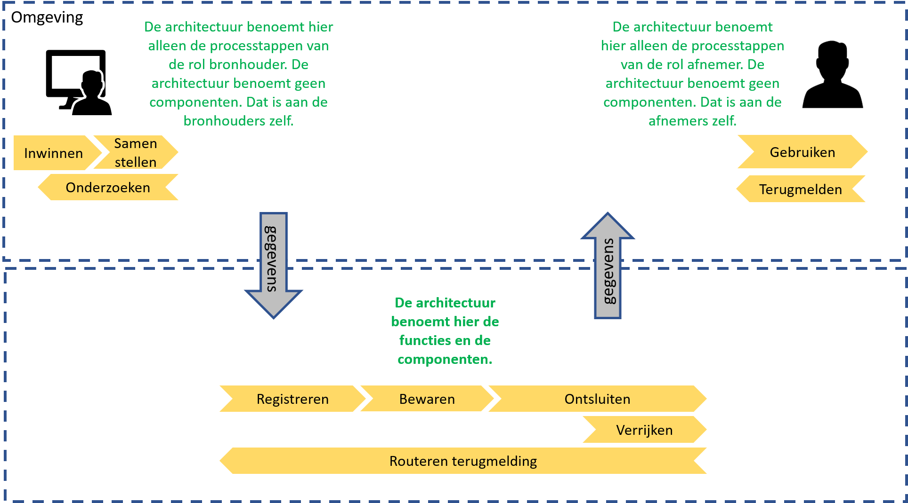
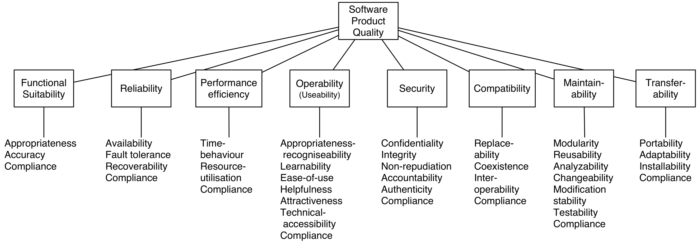

## Inrichting

### Inleiding

Dit hoofdstuk beschrijft de functionele inrichting van de Samenhangende Objectenregistratie op de applicatielaag van het NORA-vijflaagsmodel. Het doel ervan is om sturing te kunnen geven aan de transitie naar de Objectenregistratie en te dienen als kader voor technische inrichting van de Objectenregistratie. Ook biedt het een deel van de basis voor de organisatorische inrichting van de Objectenregistratie. 

Dit hoofdstuk beschrijft de onderdelen van de Objectenregistratie en de verbindingen daartussen en het wijst de functies van de Objectenregistratie toe aan deze onderdelen. 

### Functionele clusters in de inrichting

We onderscheiden drie clusters in de functionele indeling van de Objectenregistratie, zoals de afbeelding hieronder toont. Daarmee duiden we alleen het doel van de functies en doen we geen uitspraak over de technische inrichting of de verdeling ervan over verschillende ICT-voorzieningen.

<figure id="inrichtingclusters">
    
    <figcaption>Functionele clusters in de inrichting van de Objectenregistratie</figcaption>
</figure>

het cluster **Inzicht** bevat de functies die nodig zijn voor het beheren en gebruiken van gegevens over de gegevens, ofwel metagegevens. Dit cluster wordt gebruikt door de andere clusters om de gegevensstructuur en de gegevensregels te kunnen toepassen in voorzieningen en om inzicht in de gegevenskwaliteit te verkrijgen.

Het cluster **Uitvoering** bevat de functies die nodig zijn voor het beheren en afnemen van objectgegevens, zoals voor het registreren en wijzigen van gegevens en voor het raadplegen ervan. In dit cluster maken we onderscheid tussen de functies ten behoeve van het beheren van objectgegevens door gebruikers in de rol van bronhouder en het afnemen van objectgegevens door gebruikers in de rol van afnemer. 

Het cluster **Ondersteuning** bevat de functies die nodig zijn om bronhouders en afnemers te ondersteunen bij het beheren en afnemen van gegevens, zoals het beheren van machtigingen en betalingen.

De componenten in de drie clusters Inzicht, Uitvoering en Ondersteuning zijn weergegeven in onderstaand **overzicht**.

<figure id="Inzicht-inrichting-uitvoering">
    
    <figcaption>De componenten binnen de clusters Inzicht en Uitvoering en Ondersteuning</figcaption>
</figure>

### Functies in het cluster Inzicht

Op het cluster **Inzicht** onderkennen we de volgende clusters voor inzien van de gegevensstructuur en het dienstenportfolio en inzicht in de gegevenskwaliteit: 

- *Toegang*: voor het bewaken van de toegang tot de diensten.
- *Gegevenscatalogus*: voor het kunnen beschrijven van de in de objectenregistratie beschikbare gegevens en informatieproducten en deze beschrijving te ontsluiten, zodat bronhouders, afnemers en andere betrokkenen hier kennis van kunnen nemen.
 - *Gegevenskwaliteit*: voor het vastleggen van de afgesproken kwaliteitsindicatoren en het meten en monitoren wat de waarde van deze indicatoren is en zowel de indicatoren als de gemeten waarden beschikbaar te stellen voor bronhouders, afnemers en andere betrokkenen, zoals toezichthouders en beleidsverantwoordelijken.
 - *Dienstencatalogus:* voor het beschrijven van de diensten van de objectenregistratie en om deze beschrijvingen (interactief) te ontsluiten, zodat betrokkenen hier makkelijk en goed kennis van kunnen nemen.

### Functies in het cluster Uitvoering

In het cluster Uitvoering onderkennen we de volgende fucnties voor *beheer en afname van objectgegevens*:
- *Toegang*: voor het bewaken van de toegang van bronhouders en hun gemachtigden tot de beheerdiensten en van afnemers tot de afnamediensten. 
- *Registratie*: voor het creëren en wijzigen van objectgegevens door bronhouders en hun gemachtigden. De validatie die tijdens registratie wordt gedaan is ook als zelfstandige functionaliteit bruikbaar om objectgegevens te kunnen valideren zonder ze te registreren.
- *Opslag*: voor het duurzaam beschikbaar houden van objectgegevens.
- *Afname*: voor het afnemen van objectgegevens en daarvan afgeleide informatieproducten.
- *Notificatie*: voor het notificeren van afnemers van voor hen relevante gebeurtenissen die betrekking hebben op objectgegevens, zodat zij kunnen handelen naar die gebeurtenissen.
- *Terugmelding*: voor het in staat stellen van afnemers om meldingen over de juistheid van gegevens te kunnen registreren en deze beschikbaar te laten zijn voor bronhouders, zodat zij ze kunnen behandelen.

De component Terugmelding heeft als doel dat meldingen van afnemers over de juistheid van gegevens geregistreerd kunnen worden en beschikbaar zijn voor bronhouders, zodat zij ze kunnen behandelen

### Functies in het cluster Ondersteuning

In het cluster **Ondersteuning** onderkennen we de volgende functies voor de ondersteuning van bronhouders en hun gemachtigden en afnemers:
- *Toegang*: voor het bewaken van de toegang van bronhouders en hun gemachtigden en afnemers tot de ondersteuningsdiensten.
- *Machtigingen*: voor het beheren van machtigingen voor diensten door bronhouders en afnemers. 
- *Abonnementen*: voor het kunnen registreren en beheren van abonnementen door bronhouders en afnemers op notificaties over gebeurtenissen die betrekking hebben op objectgegevens waarin ze geïnteresseerd zijn, en voor het kunnen registreren en beheren van abonnementen op Afname.
- *Betalingen*: voor het beheren van betalingen van betaalde diensten door de gebruikers van die diensten, indien sprake is van betaalde diensten. Betalen kan op verschillende manieren worden ingericht, zoals vooraf, bij afname van de dienst of achteraf, en is gekoppeld aan abonnementen.

### Algemene functies

In alle drie clusters onderkennen we *Toegang* voor het bewaken van toegang tot diensten. Deze functie wordt op een plek uitgewerkt onder Algemeen. 

Verder onderkennen we de behoefte aan *Interactie* om de diensten en de gegevens en producten van de objectenregistratie aan eindgebruikers (personen in de rol van bronhouder of afnemer) te presenteren en de mogelijkheden te bieden om er mee te interacteren.

De objectenregistratie zal naar verwachting verschillende generieke interactiecomponenten bieden, bijvoorbeeld een viewer voor het zoeken en raadplegen van objectgegevens (inzage), portalen voor het beheren van machtigingen en loketten voor het indienen van terugmeldingen en het beheren van abonnementen.

Uitwerking van eisen aan Interactie staan onder Algemeen.

### Niet-functionele eisen

Aan de componenten in de drie clusters voor Inzicht, Uitvoering en Ondersteuning, bestaan ook **niet-functionele eisen**. Deze benoemen we in algemene zin overkoepelend over de clusters en componenten.

Het kan nuttig zijn om de kwaliteitsattributen te prioriteren. Bijvoorbeeld door de belangrijkste kwaliteitsattributen aan te merken die maatgevend zijn voor de kwaliteit. Deze zijn in de praktijk vaak sturend voor de architectuur en inrichtingsprincipes van een component. 

Voor de objectenregistratie gelden kwaliteitseisen aan gegevens en aan voorzieningen. De kwaliteitseisen aan gegevens worden in de informatiearchitectuur behandeld. Eisen aan de (functies van de) voorzieningen worden gesteld door opdrachtgever en ingevuld door opdrachtnemer. Met name de eisen aan de performance van de services zal hierbij steeds een aandachtspunt moeten zijn. Deze kunnen wijzigen in de tijd. 

De functies van de objectenregistratie voldoen aan eisen waarmee invulling gegeven kan worden aan de volgende *eisen aan de objectgegevens* :
Findable (goed vindbaar), 
Accessible (goed toegankelijk), 
Interoperable (interoperabel met elkaar en met niet-basisgegevens) en 
Reusable (goed herbruikbaar).

Toegankelijkheid en interoperabiliteit worden vergroot door de ICT-componenten en services aan te laten sluiten op de
[API- en URI-strategie](https://aandeslagmetdeomgevingswet.nl/digitaal-stelsel/aansluiten/standaarden/api-en-uri-strategie/) van het Digitaal Stelsel Omgevingswet.

Voor ICT-componenten en services waarmee de functies beschikbaar gemaakt worden, zijn niet-functionele eisen van toepassing volgens de ISO25010 standaard. Deze betreffen kwaliteit-in-gebruik en productkwaliteit.

<figure id="kwaliteit-in-gebruik">
    
    <figcaption>Kwaliteit-in-gebruik volgens ISO25010</figcaption>
</figure>

     Voor **kwaliteit-in-gebruik** van de functies van de objectenregistratie zijn eisen van toepassing aangaande effectiviteit, efficiëntie, voldoening, vrijheid van risico en dekking van contexten. 
	 
De eisen aangaande dekking van contexten vertalen de vereiste flexibiliteit van de objectenregistratie-als-geheel naar de vereiste flexibiliteit van de ICT componenten. Denk hierbij aan de aanpasbaarheid van componenten aan veranderingen in de scope van basisgegevens en de structuur van basisgegevens. 

<figure id="productkwaliteit">
    
    <figcaption>Productkwaliteit volgens ISO25010</figcaption>
</figure>

     Voor **productkwaliteit** van de functies van de objectenregistratie zijn eisen van toepassing aangaande functionele geschiktheid, betrouwbaarheid, performance, bruikbaarheid, beveiliging, compatibiliteit, onderhoudbaarheid en overdraagbaarheid. 
	 
De eisen aan compatibiliteit betreffen onder andere de interoperabiliteit. Deze zijn zodanig dat gangbare technologie wordt toegepast waarmee een grote mate van technische interoperabiliteit wordt bereikt. Tegelijk maken de eisen aan interoperabiliteit van ICT-componenten en services mogelijk dat op niveau van de gegevens ook semantische interoperabiliteit wordt ondersteund. Beide niveaus van interoperabiliteit zijn noodzakelijk voor het bereiken van interoperabiliteit tussen organisaties, waardoor alle (overheids)organisaties met dezelfde basisgegevens kunnen werken.

