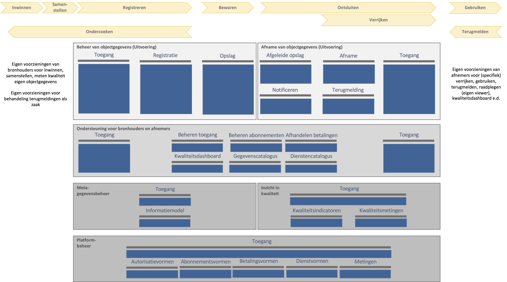

## Inrichting van de Objectenregistratie

### Inleiding

Dit hoofdstuk beschrijft de functionele (of conceptuele) inrichting van de Samenhangende Objectenregistratie op de applicatielaag van het NORA-vijflaagsmodel. Het doel ervan is om sturing te kunnen geven aan de transitie naar de Objectenregistratie en te dienen als kader voor technische inrichting van de Objectenregistratie. Ook biedt het een een deel van de basis voor de organisatorische inrichting van de Objectenregistratie. 

Dit hoofdstuk beschrijft de onderdelen (of componenten) van de Objectenregistratie en de verbindingen daartussen en het wijst de functies van de Objectenregistratie toe aan deze onderdelen. Het beschrijft ook de benodigde standaarden voor de Objectenregistratie en de relatie met de inhoud van de Objectenregistratie (op de gegevenslaag van het NORA vijflaagsmodel).

     WB: Bij de beschrijving van de relatie met de inhoud van de Objectenregistratie heb ik nog geen beeld. Vooralsnog is mijn verwachting dat alle gegevens in de Opslag-component worden bewaard, evt. gedistribueerd over meerdere locaties.

### Functionele lagen in de inrichting

We onderscheiden vier lagen in de functionele indeling van de Objectenregistratie, zoals de afbeelding hieronder toont. Daarmee duiden we alleen het doel van de functies (bijvoorbeeld beheren of afnemen van objectgegevens) en doen we geen uitspraak over de de technische inrichting of de verdeling ervan over verschillende ICT-voorzieningen.

<figure id="inrichtinglagen">
    
    <figcaption>Functionele lagen in de inrichting van de Objectenregistratie</figcaption>
</figure>

De **Uitvoeringslaag** bevat de functies die nodig zijn voor het voor het beheren en afnemen van objectgegevens, zoals voor het registreren en wijzigen van gegevens en voor het raadplegen ervan. Op deze laag maken we onderschied tussen de functies ten behoeve van het beheren van objectgegevens door bronhouders en het afnemen ervan door afnemers van de Objectenregistratie. 

De **Ondersteuningslaag** bevat de functies die nodig zijn om bronhouders en afnemers te ondersteunen bij het beheren en afnemen van gegevens, zoals het beheren van autorisaties en het raadplegen van gegevens- en dienstencatalogi.

De volgende laag bevat de functies die betrekking hebben op het beheren van meta-data en bestaat uit twee delen: **Meta-gegevensbeheer** en **'Inzicht in kwaliteit'**. Meta-gegevensbeheer bevat de functies die nodig zijn om informatiemodellen, gegevensregels en gegevens- en dienstencatalogi te beheren. 'Inzicht in kwaliteit' bevat de functies om kwaliteitsindicatoren te beheren en kwaliteitsanalyses te doen.

De laag **Platformbeheer** bevat de functies voor het beheren van het platform, of de platformen, die het beheren en afnemen van objectgegevens en meta-gegevens mogelijk maken.

     WB: Platformbeheer moet worden vervangen door Voorzieningenbeheer.

### Functies in de lagen Uitvoering en Ondersteuning

De lagen Uitvoering en Ondersteuning bevatten de functies voor: 1) het beheren en afnemen van objectgegevens en 2) ondersteuning van bronhouders en afnemers. Onderstaande afbeelding toont de clusters van functionaliteiten op deze lagen. Deze clustering is een functionele indeling, geen technische. Het groepeert functies die bijdragen aan hetzelfde doel.

<figure id="inrichtinguitvoeringondersteuning">
    
    <figcaption>De capability-clusters op de lagen Uitvoering en Ondersteuning</figcaption>
</figure>

Op de **Uitvoeringslaag** onderkennen we de volgende clusters voor *beheer van objectgegevens*:
- *Toegang*: voor het bewaken en loggen van de toegang van bronhouders en hun gemachtigden tot de beheerdiensten.
- *Registratie*: voor het creëren en wijzigen van objectgegevens door bronhouders en hun gemachtigden.
- *Opslag*: voor het duurzaam beschikbaar houden van gegevens over objecten en objecteigenschappen.

Voor het *afnemen van objectgegevens* onderkennen we de volgende clusters:
- *Afgeleide opslag*: voor het beschikbaar maken van gegevens afgestemd op de specifieke behoeften van het afnemen van objectgegevens door grote aantallen afnemers.
- *Afname*: voor het afnemen van objectgegevens op verschillende manieren, variërend van het raadplegen van enkelvoudige gegevens tot gecombineerde afname en afnamen in 'bulk' voor bijvoorbeeld analysedoeleinden.
- *Notificatie*: voor het notificeren van afnemers van voor hen relevante gebeurtenissen (we gebruiken gebeurtenissen hier in brede zin, breder dan alleen gebeurtenissen die de objectgegevens betreffen)
- *Terugmelding*: voor het in staat stellen van afnemers om bij gerede twijfel aan de juistheid van gegevens dit te melden.
- *Toegang*: voor het bewaken en loggen van de toegang van afnemers tot de afnamediensten. 

Op de **Ondersteuningslaag** onderkennen we de volgende clusters voor de ondersteuning van bronhouders en afnemers en hun gemachtigden en leveranciers:
- *Toegang*: voor het bewaken en loggen van de toegang van bronhouders en afnemers tot de ondersteuningsdiensten.
- *Beheren toegang*: voor het beheren van autorisaties op gegevens en diensten door bronhouders en afnemers zelf en eventueel ook door de beheerder van de ICT-voorziening(en).
- *Beheren abonnementen*: voor het beheren van abonnementen op gebeurtenissen door bronhouders en afnemers
- *Afhandelen betalingen*: voor het betalen van betaalde diensten door de gebruikers van die diensten (indien sprake is van betaalde diensten) (betalen kan op verschillende manieren worden ingericht, vooraf, bij afname van de dienst of achteraf)
- *Kwaliteitsdashboard*: voor het inzien van de waarden van kwaliteitsindicatoren
- *Gegevenscatalogus*: voor het inzien van de beschikbare soorten objectgegevens, eigenschappen en relaties en de betekenis daarvan
- *Dienstencatalogus:* voor het inzien van de beschikbare gegevensproducten en diensten voor het beheren en afnemen ervan

     WB: We moeten onderscheid maken tussen abonnementen en notificaties mbt gegevens (bijv voor bronhouders en afnemers) en abonnementen op andersoortige gebeurtenissen (bijv ontwikkelingen die relevant zijn voor softwareontwikkelaars en beheerders bij bronhouders en afnemers)  

Onderstaande afbeelding toont de functionaliteiten per cluster op deze twee lagen. Deze functionaliteiten zijn beschreven in de Bijlage Functionaliteiten

<figure id="functiesuitvoeringondersteuning">
    
    <figcaption>De capabilities op de lagen Uitvoering en Ondersteuning</figcaption>
</figure>

     WB: De bijlage met de detail beschrijving van de functionaliteiten per cluster moet nog worden opnemen in de bijlagen  

### Functies in de laag Meta-gegevensbeheer en Inzicht in kwaliteit

Onderstaande afbeelding toont de clusters van functionaliteiten op lagen Meta- en platformbeheer in aanvulling op de lagen Uitvoering en Ondersteuning. Deze paragraaf beschrijft de clusters op de laag **Metabeheer**. De volgende paragraaf beschrijft de clusters op de laat **Platformbeheer**.

<figure id="functiesmetaplatformbeheer">
    
    <figcaption>De capabilities op alle vier de lagen</figcaption>
</figure>

De laag **Metabeheer** bestaat uit de delen **Metagegevensbeheer** en **Inzicht in kwaliteit**. Het deel Metagegevensbeheer bevat de volgende clusters aan functionaliteiten:
- *Toegang*: voor het bewaken en loggen van de toegang van meta-beheerders tot de beheerdiensten.
- *Informatiemodel*: voor het beheren van het informatiemodel, de gegevensregels en de gegevens- en dienstencatalogi.

Het deel 'Inzicht in kwaliteit' bevat de volgende clusters aan functionaliteiten:
 - *Toegang*: voor het bewaken en loggen van de toegang van meta-beheerders tot de diensten.
 - *kwaliteitsindicatoren*: voor het beheren van de door bronhouders en afnemers en andere betrokkenen (zoals toezichthouder en  beleidsverantwoordelijke) overeengekomen kwaliteitsindicatoren
 - *Kwaliteitsmetingen:* Voor het bepalen van de waarden van de kwaliteitsindicatoren, bijvoorbeeld door middel van analyses

### Functies in de laag Platformbeheer

De laag Platformbeheer bevat de volgende clusters aan functionaliteiten:
 - *Toegang*: voor het bewaken en loggen van de toegang van platformbeheerders.
 - *Autorisatievormen*: voor het beheren van de beschikbare autorisatievormen.
 - *Abonnementsvormen*: voor het beheren van de beschikbare abonnementsvormen.
 - *Betalingsvormen*: voor het beheren van de beschikbare betalingsvormen.
 - *Dienstvormen*: voor het beheren van de beschikbaren dienstvormen.
 - *Metingen*: voor het uitvoeren van metingen en raadplegen van uitgevoerde metingen en beschikbaar meetgegevens, zoals aantallen gebruiker.
 

     WB: Wat is het verschil tussen beheren van dienstvormen op deze laag en beheren van de dienstencatalogus op de laag Meta-beheer?  

### Componenten en samenhang

(waaronder de landelijke en bronhouderonderdelen)

### Benodigde standaarden

### Relatie met de inhoud van de Objectenregistratie

Op de gegevenslaag van het NORA vijflaagsmodel

     WB: Bij de beschrijving van de relatie met de inhoud van de Objectenregistratie heb ik nog geen beeld. Vooralsnog is mijn verwachting dat alle gegevens in de Opslag-component worden bewaard, evt. gedistribueerd over meerdere locaties.

