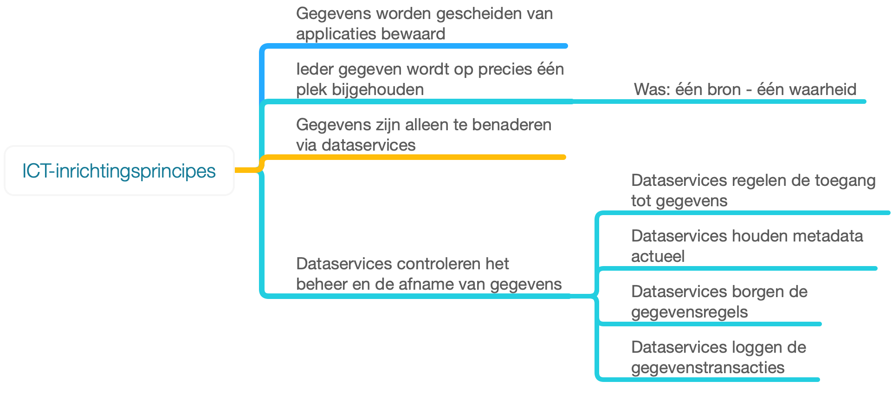
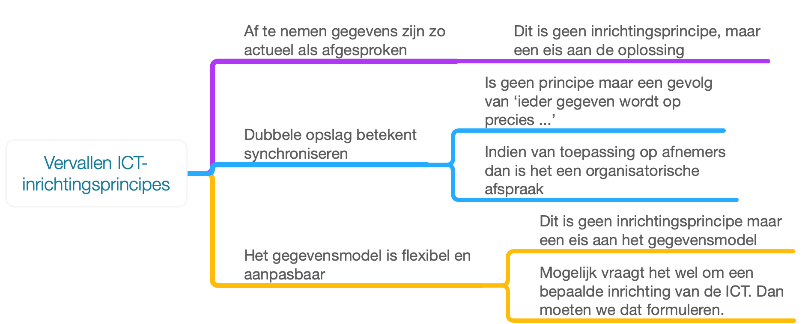

## ICT-inrichtingsprincipes

     WB: Ik heb dit hoofdstuk beperkt tot de ICT-inrichtingsprincipses voor de SOR en de context en achtergrond grotendeels verplaatst naar de bijlagen. De lezer hoeft alleen de resultatende principes te zien. Als de lezer geinteresseerd is in de achtergronden en afwegingen en hoe de principes zich verhouden tot de boven- (of onderliggende) principes dan is dat in de bijlage te vinden. Die bijlagen moeten we nog wel aanpassen aan de uiteindelijke inhoud van dit hoofdstuk.

### Inleiding

Dit hoofdstuk bevat de principes die richtinggevend zijn voor de functionele inrichting van de ICT-voorzieningen voor de Objectenregistratie. 

Bij het opstellen van de principes zijn de volgende bronnen gehanteerd:
- De beleidsvisie DiS Geo, (of "de [houtskoolschets](https://www.geobasisregistraties.nl/basisregistraties/documenten/publicatie/2020/06/15/dis-online-als-stroom-uit-het-stopcontact)").
- De [Overall Globale Architectuur Schets (OGAS)](https://aandeslagmetdeomgevingswet.nl/publish/library/219/dso_-_gas_-_overall_gas_1.pdf) van het Digitaal Stelsel Omgevingswet. Bij het opstellen van de architectuurschets voor het DSO is recent gekeken naar diverse andere relevante richtinggevende principes zoals [NORA](#basisprincipes-nora), [GEMMA](#inrichtingsprincipes-gemma) en [Common Ground](#inrichtingsprincipes-common-ground) en is een hanteerbare set principes afgeleid.
- Internationale architectuurprincipes van W3C, en met name  de principes uit [Spatial Data on the Web Best Practices](https://www.w3.org/TR/sdw-bp/#bp-summary) die zijn opgetekend op basis van vele internationale ervaringen met het omgaan met geo-gegevens. 

     WB: Zijn beleidsvisie DiS Geo en houtskoolschets hetzelfde?

     WB: Er is ook een visie Objectenregistratie (oid). Daar moeten we ook nog naar kijken.

     WB: Is bovenstaande opsomming volledig? We moeten nog toetsen in hoeverre de 'web best practices' nog relevant zijn, omdat we geconstareerd hebben dat deze vooral over de inhoud gaan en minder over de functionele ICT-inrichting. Ook moeten we nog toetsen in hoeverre we nog steeds voortbouwen op de principes uit de OGAS DSO.

     WB: Ik heb de paragraaf mbt het doel van de SOR verplaatst naar het hoofdstuk Afbakening.

     WB: Ik heb Inrichtingsprincipes van DSO, Spatial Data en Common Ground verplaatst naar de bijlagen.

    WB: Ik heb ook de verantwoording aan de DiS Geo / Houtskoolschets principes verplaatst naar de bijlage. 

    WB: We moeten nog bepalen in hoeverre de API-strategie van toepassing is en of we daar expliciet zaken uit over willen nemen of deze in z'n volledigheid van toepassing verklaren. Daarnaast moeten we denk ik tzt ook benoemen welke standaarden van de Pas-toe-of-leg-uit-lijst en eventuele andere bronnen van toepassing zijn op de SOR. 

### ICT-inrichtingsprincipes Samenhangende Objectenregistratie

Voor de ICT-inrichting van de Samenhangende Objectenregistratie hanteren we de onderstaande principes. Met 'de oplossing' bedoelen we steeds de ICT-voorzieningen die de Samenhangende Objectenregistratie realiseren.

    WB: Willen we 'de oplossing' vervangen door 'de ICT-voorzieningen'?

    WB: Voor alle principes geldt dat we niet goed uitleggen waarom we het principe hanteren. Ik heb  een poging gedaan om dat toe te voegen met ', zodat ...'. 

    WB: Ik ben nog niet tevreden met onze ICT-inrichtingsprincipes. Hieronder mijn beeld van wat de relevante ICT-inrichtingsprincipes zijn en welke wat mij betreft vervallen en waarom. Ik stel voor om op dit moment zo min mogelijk aparte principes te formuleren. Pas als we echt inrichtingskeuzes gaan maken, gaan we er achter komen wat de echte relevante principes zijn. Laten we ons daarom op dit moment beperken tot wat we nu denken dat essentieel is. Om te voorkomen dat we de inzichten van nu vergeten hebben we backups gemaakt van de oude versies van dit hoofdstuk en de bijbehorende bijlagen.

 **_Mijn (WB) beeld van de relevante ICT-inrichtingsprincipes :_**
 - **Gegevens worden gescheiden van applicaties bewaard**, zodat het beheren en afnemen van gegevens onafhankelijk is van de gebruikte applicaties en gegevens te (her)gebruiken zijn in verschillende applicaties voor verschillende doeleinden.
 - **Ieder gegeven wordt op precies &eacute&eacuten plek bijgehouden**, zodat altijd duidelijk is wat het actuele brongegevens is en waar dat wordt beheerd.
 - **Gegevens zijn alleen te benaderen via dataservices**, zodat deze services kunnen garanderen dat de gegevens, metagegevens en de toegang ertoe altijd voldoen aan de eisen en dat logging altijd plaatsvindt. Dit was: "een bron - een waarheid".
 - **Datasservices controleren het beheer en de afname van gegevens**, zodat de services kunnen garanderen dat de gegevens, metagegevens en de toegang ertoe altijd voldoen aan de eisen en dat logging altijd plaatsvindt. N.B. als dit de correcte 'zodat' is, dan is dit principe hetzelfde als het vorige principe en moeten we ze samenvoegen tot 1. Dit principe heeft de volgende onderliggende principes in zich:
    - **Dataservices regelen de toegang tot gegevens**, zodat deze services ervoor kunne zorgen dat altijd is voldaan aan de toegangseisen.
    - **Dataservices houden metadata actueel**, zodat data en meta-data altijd onderling consistent zijn.
    - **Dataservices borgen de gegevensregels**, zodat gegarandeerd is dat de gegevens altijd voldoen aan de gegevensregels. **N.B.** niet 'borgen de kwaliteit' want kwaliteit is veel breder dan alleen volgoen aan de gegevensregels.

<figure id="ictinrichtingsprincipes">
    
    <figcaption></figcaption>
</figure>

**_Mijn (WB) beeld welke principes kunnen vervallen en waarom:_**
- **Af te nemen gegevens zijn zo actueel als afgesproken**, zodat het verschil in actualiteit  tussen de gegevens die door bronhouders worden bijgehouden en gegevens die worden verstrekt aan afnemers nooit groter is dan afgesproken. **Waarom laten vervallen?** Dit is geen inrichtingsprincipe maar een eis aan de oplossing. **Dit was:** 'De oplossing zorgt dat af te nemen gegevens altijd actueel zijn'. De eis dat de verstrekte gegevens altijd dezelfde actualiteit hebben als de bijgehouden gegevens is een inhoudelijke eis en geen ICT-eis. Bovendien is het nog maar de vraag of de actualiteit echt exact hetzelfde moet zijn. Een betere formulering is daarom: "Af te nemen gegevens zijn zo actueel als afgesproken". Dat maakt het wat mij betreft echter nog steeds geen ICT-inrichtingsprincipe.
- **Dubbele opslag betekent synchroniseren,** zodat ... **Waarom laten vervallen?** Dit is geen principe, maar een gevolg van 'Ieder gegeven wordt op precies &eacute&eacuten plek bijgehouden.'. Bovendien, dat een afnemer die een eigen kopie heeft zelf verantwoordelijk is voor het synchroniseren is een organisatorische afspraak en geen ICT-principe.
- **Het gegevensmodel is flexibel en aanpasbaar**, zodat ... **Waarom laten vervallen?** Dit is geen ICT-inrichtingsprincipe maar een eis aan het gegevensmodel. Mogelijk vraagt het wel om een bepaalde inrichting van de ICT-voorzieningen, maar dan moeten we formuleren wat daar het principe voor is.

<figure id="vervallen principes">
    
    <figcaption></figcaption>
</figure>

    WB: De tekst die hieronder volgt is een mix van oude tekst en deels door mij aangepaste tekst. Voordat we de tekst 'definitief' maken moeten we het echter eerst eens zijn over wat de principes zijn. Ik ben daarom gestopt met de tekst hieronder te redigeren. Eerst eens worden over de lijstjes hierboven.

**Gegevens en functionaliteit zijn gescheiden**

    WB: Bij Common Ground betekent dit principe dat gegevens los van applicaties worden opgeslagen. Het betekent bij CG niet dat gegevens alleen via services te benaderen zijn. Dat is bovendien een op zichzelf staand principe dat we verderop formuleren. Beide principes zijn wel relevant, maar hebben allebei een andere rationale. Zie mijn lijstje hierboven.

Gegevens kunnen alleen worden benaderd via dataservices. Onder 'benaderen' verstaan we het maken, lezen en aanpassen van gegevens.
Gegevens worden nooit verwijderd, maar *gemarkeerd* als 'verwijderd'. Applicaties kunnen alleen via de dataservices gegevens maken, lezen en aanpassen. Onderstaande afbeelding uit de API-strategie geeft dit weer.

<figure id="apitoegang">
        
    <figcaption>Gegevens kunnen alleen worden benaderd via dataservices.</figcaption>
</figure>

De ontkoppeling en interoperabiliteit van de gegevens maken verandering mogelijk (middels API strategie en URI strategie)

**De oplossing zorgt dat af te nemen gegevens altijd actueel zijn**

Alle mutaties vinden plaats op de samenhangende gegevensset. Een wijziging aan een gegeven wordt genotificeerd. Daardoor kunnen afnemers zorgen dat ze actuele gegevens blijven afnemen.

**E&eacuten bron - &eacute&eacuten waarheid**
De oplossing zorgt ervoor dat ieder gegeven in &eacute&eacuten bron wordt bijgehouden. Dit voorkomt dat er meerdere bronnen voor hetzelfde gegeven bestaan. 

**Dubbele opslag betekent synchroniseren**
Partijen die, om wat voor reden dan ook, een kopie dataset willen beheren, kunnen en mogen dat doen, maar zijn dan zelf verantwoordelijk voor het up-to-date houden van die gegevensset.  

Dit geldt zowel binnen als buiten de oplossing, dus ook voor eventuele afgeleide opslag die geoptimaliseerd is ten behoeven van verstrekking.

    WB: Dat een afnemer die een eigen kopie heeft zelf verantwoordelijk is voor het synchroniseren, is een organisatorische afspraak, geen ICT-inrichtingsprincipe.

**Gegevens kunnen alleen via Dataservices worden benaderd**
Om te garanderen dat de gegevens blijven voldoen aan de gestelde kwalteit en actualiteit kunnen ze alleen benaderd 
worden via *Dataservices*. Directe toegang tot de gegevens vanuit applicaties is ten strengste verboden. 

Dit principe zorgt ervoor dat gegevens blijven voldoen aan de (integriteits-)eisen, doordat de dataservices dit waarborgen. Ook zorgt dit principe ervoor dat er een ontkoppeling is tussen de gegevens en de ontsluiting ervan. Dat maakt het mogelijk om veranderingen aan te brengen in de gegevensopslag of in de dataservices zonder dat deze elkaar beïnvloeden.

**Dataservices controleren**
Alle controles, of het nou gaat om toegangscontrole tot de gegevens, of kwaliteitscontroles worden gedaan door
de dataservices, en niet door applicaties. Zoals al eerder gezegd: aplicaties benaderen de gegevens via de dataservices en niet direct.
Applicaties zorgen wel voor een nette foutafhandeling: als een service een foutcode retourneet, zorgt de applicatie
voor de afhandeling van die fout door het geven van een melding, of door een nieuwe aanroep van de dataservice.

- *Dataservices loggen de transacties op de gegevens*
Alle (!) transacties op de gegevens worden gelogd. Dit is nodig om een audit-trail te kunnen opbouwen.

- *Dataservices houden metadata up-to-date*
Waar mogelijk wordt de metadata door de dataservices up-to-date gehouden. Denk hierbij aan datum laatste mutatie, door wie gemuteerd, enz.

- *Dataservices controleren*
Alle controles, of het nou gaat om toegangscontrole tot de gegevens, of kwaliteitscontroles worden gedaan door
de dataservices, en niet door applicaties. Zoals al eerder gezegd: aplicaties benaderen de gegevens via de dataservices en niet direct.
Applicaties zorgen wel voor een nette foutafhandeling: als een service een foutcode retourneet, zorgt de applicatie
voor de afhandeling van die fout door het geven van een melding, of door een nieuwe aanroep van de dataservice.

- *Dataservices regelen de toegang tot de gegevens*
Bij het aanroepen van de dataservices wordt gecontroleerd of de gebruiker de gegevens wel mag benaderen.
Benaderen kan weer zijn: maken, lezen en aanpassen. De dataservice controleert of de gebruiker wel de rechten
heeft om de gegevens te maken, te lezen of aan te passen. Wat een gebruiker mag wijzigen hangt ook van de *klassificatie*
van de gegevens af. 

- *Dataservices loggen de transacties op de gegevens*
Alle (!) transacties op de gegevens worden gelogd. Dit is nodig om een *audit-trail* te kunnen opbouwen.

- *Dataservices borgen de kwaliteit van de gegevens*
Alle (!) controles die moeten plaatsvinden voordat een gegeven wordt gewijzigd worden in de dataservice gedaan.  

Enkele voorbeelden van een kwailiteitscheck: 
- domeinwaarde check: komt de nieuwe waarde voor in een lijst met geldige waarden, of ligt de nieuwe waarde tussen twee grenswaarden.
- datum check: is de waarde volgens een bepaald datum formaat.
- type check: is de nieuwe waarde wel van een bepaald datatype.
- referentie check: mag een gegeven worden gemarkeerd als verwijderd, terwijl het gegeven nog ergens anders bestaat? 

**Het Gegevensmodel is flexibel en aanpasbaar**  

     JvG: Dit principe is toegevoegd, maar nog niet besproken in de groep architectuur 

Een uitgangspunt voor het gegevensmodel van de SOR is dat het informatiemodel flexibel moet zijn. Eenvoudig aan te passen, en het onderscheid tussen verplichte en vrijwillige objecten in de registratie moet niet diepgaand in het uitgewerkte gegevensmodel worden verankerd.  
De oplossing moet met deze flexibiliteit in het gegevensmodel om kunnen gaan zodat het weinig impact heeft op de dataservices, en daarmee de applicaties die van die services gebruik maken, als er iets wijzigt. 

