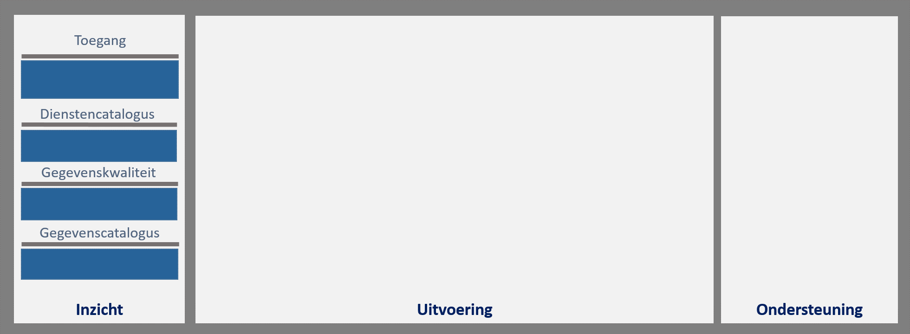

## Uitwerking

### Inleiding

**Dit hoofdstuk bevat de uitwerking van de componenten van de objectenregistatie.**

Per component is eerst beschreven wat het doel is van de component. 
Vervolgens wordt aangegeven:
1.  Op welke bestaande uitwerkingen de invulling van de component is gebaseerd.
2.  Welke uitgangspunten, zoals bestaande standaarden, voor de invulling van de component gelden.
3.  Aan welke vereisten de component dient te voldoen.
4.  Welke externe afhankelijkheden de component heeft.

De uitwerking van de componenten is zoveel als mogelijk gebaseerd op bestaande, breed geaccepteerde en gehanteerde nationale of internationale uitwerkingen.

De uitwerking van de componenten is een functionele uitwerking die meerdere technische invullingen mogelijk maakt. Technische keuzes worden alleen voorgeschreven als ze essentieel zijn, bijvoorbeeld keuzes voor technische standaarden in het kader van interoperabiliteit en het voldoen aan afspraken binnen de overheid of nationale of internationale afspraken.

Onder [Algemeen](#algemeen) beschrijven we de onderwerpen die op meerdere plaatsen
in de architectuur voorkomen. Deze onderwerpen zijn daar eenmalig
uitgewerkt.

### Cluster Uitvoering

Onderstaande afbeelding toont de groepen van functionaliteiten op het cluster Uitvoering. Deze groepering is een functionele, geen technische. Hij groepeert functies die bijdragen aan hetzelfde doel.

<figure id="functiesuitvoering">
    
    <figcaption>De functies binnen het cluster Uitvoering</figcaption>
</figure>

Het cluster **Uitvoering** bevat de functies voor het beheren van objectgegevens en voor het afnemen van objectgegevens
Algemene onderwerpen zoals Toegang en Interactie zijn uitgewerkt in het onderdeel Algemeen.

#### Registratie

De component Registratie heeft als doel om bronhouderorganisaties en gemachtigde organisaties in staat te
stellen objectgegevens en bijbehorende meta-gegevens te beheren (toevoegen en
wijzigen). Deze component biedt de services die bronhouders en gemachtigden daarvoor nodig
hebben.

De component Registratie biedt services voor informatiesystemen om
objectgegevens te beheren (toe te voegen en te wijzigen). 

Deze component bevat geen functionaliteit voor interactie en presentatie. 

**Invulling**

De uitwerking van deze component is onder andere gebaseerd op:

-   Voor geo-gegevens: [OGC API - Features - Part 4: Simple Transactions](http://docs.opengeospatial.org/DRAFTS/20-002.html)  
   
-   Voor administratieve gegevens: [API-strategie](https://docs.geostandaarden.nl/api/API-Strategie/)

Bovenstaande twee uitwerkingen bieden geen volledige basis voor de uitwerking
van de component Registratie, maar bij de auteurs zijn geen andere uitwerkingen
bekend die als basis kunnen dienen.

In het kader van OGC API – Features wordt gewerkt aan meer Parts. Op een later
moment wordt bepaald of deze basis vormen voor de uitwerking van de componenten.

In het kader van het GEMMA Gegevenslandschap, Common Ground en kennisplatform
API’s wordt gewerkt aan API-criteria. Op een later moment wordt bepaald of deze
basis vormen voor de uitwerking van de componenten.

In het kader van het GEMMA Gegevenslandschap en Common Ground is een uitwerking
beschikbaar van logging en registratie van verwerking van gegevens. In hoeverre
die uitwerking van toepassing is op de component Registratie moet nog worden
bepaald.

**Uitgangspunten**

Voor de uitwerking van de component gelden de volgende uitgangspunten:

-   Geen uitgangspunten.

**Vereisten**

Voor deze component gelden de volgende vereisten:

1.  Bij elke toevoeging of wijziging van een gegeven vindt vooraf validatie aan de
    gegevensregels plaats. Alleen valide gegevens worden geregistreerd. 

2.  Van iedere gegevenswijziging wordt tenminste vastgelegd: 
    welk gegeven is geregistreerd of gewijzigd, 
	de identificatie van het geregistreerde of gewijzigde object, 
	de organisatie die de wijziging heeft gedaan, 
	de voor de wijziging gebruikte dienst, 
	datum en tijdstip van registratie van de wijziging.

3.  Van ieder gebruik van een registratiedienst wordt tenminste vastgelegd: 
	datum en tijdstip van gebruik, 
	organisatie die gebruikt, 
	zodat een audit log beschikbaar is. 

Opmerking:

-   Gegevens worden niet verwijderd. Een beëindiging van een object wordt geregistreerd als een wijziging (bijvoorbeeld het invullen van een einddatum).
-   Het vastleggen en beheren van gegevensregels valt binnen de component Gegevenscatalogus en niet binnen de component Registratie.

**Externe afhankelijkheden**

Deze component heeft de volgende externe afhankelijkheden:

-   Geen externe afhankelijkheden.

#### Opslag

De component Opslag heeft als doel het duurzaam beschikbaar houden van
objectgegevens en bijbehorende metagegevens, zodat bronhouders deze gegevens
kunnen beheren en zodat de gegevens beschikbaar zijn voor de verstrekker zodat
deze ze kan verstrekken aan afnemers in de vorm van gegevens of daarvan
afgeleide informatieproducten.

**Invulling**

De uitwerking van deze component is onder andere gebaseerd op:

-   Er zijn geen nationale of internationale standaarden of andere uitwerkingen
    om de opslag-component op te baseren.

**Uitgangspunten**

Voor de uitwerking van de component gelden de volgende uitgangspunten:

-   De opslag-component is alleen via services te benaderen. De technische wijze van opslag is verantwoordelijkheid van de aanbieder van de component.

**Vereisten**

Voor deze component gelden de volgende vereisten:

1.  De gegevens in de opslag voldoen aan hun gegevensmodel 

2.  De opslag voldoet aan eisen aan duurzaamheid en toegankelijkheid van de gegevens.

3.  De opslag bevat alle gegevens die nodig zijn om de bronhouders
    objectgegevens te kunnen laten bijhouden* en om deze gegevens beschikbaar te
    maken voor de verstrekker.
	
*De rol bronhouder “houdt objectgegevens bij”, dat wil zeggen dat de bronhouder de gegevens registreert en de gegevens conform gestelde eisen in overeenstemming houdt met de werkelijkheid. Daartoe moet de bronhouder zelf zorgen voor het (laten) inwinnen en samenstellen van nieuwe gegevens. 

4.  Door het scheiden van proceslogica van procesgegevens en gegevens zal de
    opslag naast objectgegevens ook procesgegevens moeten omvatten. Denk aan
    het bijhouden wie welke wijzigingen heeft doorgevoerd en wanneer. Procesgegevens worden samen met de gegevens opgeslagen.

5.  Procesgegevens verzorgen het opbouwen van de audit trial.

6.  De opslag is enkel en alleen benaderbaar via services.

7.  De opslag maakt data-portabiliteit mogelijk. De gegevens moeten met beperkte
    inspanning overgezet kunnen worden naar een andere manier van opslaan van gegevens.

Voorbeeld: als de opslag in een nieuw soort “database” gaat plaatsvinden, moet overzetten met een beperkte inspanning mogelijk zijn.

**Externe afhankelijkheden**

Deze component heeft de volgende externe afhankelijkheden:

-   Eisen vanuit de Archiefwet.
-   Externe eisen aan informatieveiligheid zoals Baseline Informatiebeveiliging Overheid (BIO).

#### Afname

De component Afname heeft als doel om afnemers in staat te stellen
objectgegevens en daarvan afgeleide gegevens af te nemen, zodat ze
deze gegevens en afgeleide gegevens kunnen gebruiken in hun eigen processen. Deze
component biedt toegang tot alle voor afnemers beschikbare objectgegevens,
inclusief meta-gegevens, en tot alle door de objectenregistratie beschikbaar gestelde
afgeleide gegevens.

De component Afname biedt services voor informatiesystemen om objectgegevens en
afgeleide gegevens af te nemen. De component bevat geen functionaliteit voor
het presenteren van deze gegevens of afgeleide gegevens aan gebruikers in bijvoorbeeld
een viewer. Daarvoor zijn aparte interactiecomponenten nodig die gebruik maken
van de services van de component voor Afname.

**Invulling**

De uitwerking van deze component is onder andere gebaseerd op:

-   Voor geo-gegevens: [OGC API - Features - Part 1: Core](http://docs.opengeospatial.org/is/17-069r3/17-069r3.html)
	
Opmerking: OGC Part 4 (Transactions for versioned Features) sluit niet aan bij basisregistraties naar oordeel van de betreffende werkgroep. Daarom nemen we dit part niet op.

-   Voor administratieve gegevens: [API-strategie](https://docs.geostandaarden.nl/api/API-Strategie/)

Bovenstaande twee uitwerkingen bieden geen volledige basis voor de uitwerking
van de component Afname, maar bij de auteurs zijn geen andere uitwerkingen
bekend die als basis kunnen dienen.

In het kader van OGC API – Features wordt gewerkt aan meer Parts. Op een later
moment wordt bepaald of deze basis vormen voor de uitwerking van de
componenten.

In het kader van het GEMMA Gegevenslandschap, Common Ground en kennisplatform
API’s wordt gewerkt aan API-criteria. Op een later moment wordt bepaald of deze
basis vormen voor de uitwerking van de componenten.

In het kader van het GEMMA Gegevenslandschap en Common Ground is een uitwerking
beschikbaar van logging en registratie van verwerking van gegevens. In hoeverre
die uitwerking van toepassing is op de component Afname van Gegevens en
Informatie moet nog bepaald worden.

**Uitgangspunten**

Voor de uitwerking van de component gelden de volgende uitgangspunten:

-   Geen uitgangspunten.

**Vereisten**

Voor deze component gelden de volgende vereisten:

1.  Gegevens zijn alleen te benaderen via services. Daarom worden
    in ieder geval alle dataservices geboden die nodig zijn om alle beschikbare
    gegevens te kunnen afnemen (in de API-strategie worden
    dataservices systeemservices genoemd).

2.  Naast dataservices biedt deze component ook gemaks- en processervices* voor
    zover deze onderdeel zijn van het portfolio van de objectenregistratie.
	
	*gemaksservices beantwoorden een generieke gebruikersvraag, processervices roepen meerdere services aan (ze heten daarom ook wel orchestratie services).

3.  Functionaliteit voor het samenstellen van afgeleide gegevens uit objectgegevens
    maakt altijd gebruik van de dataservices voor afname van objectgegevens.

4.  Van ieder gebruik van een afnamedienst wordt ten minste vastgelegd: datum en
    tijdstip, organisatie. Dit kan gebruikt worden om te meten of het
    gebruik binnen de overeengekomen grenzen van gebruik blijft. Bijvoorbeeld
    grenzen aan ‘fair use’ voor open diensten en grenzen aan gebruik van
    diensten met gegarandeerd dienstenniveau en grenzen aan gebruik van
    eventuele betaalde diensten.

**Externe afhankelijkheden**

Deze component heeft de volgende externe afhankelijkheden:

-   Geen externe afhankelijkheden

##### Afgeleide opslag

Functioneel gezien is er een Opslag.

Ten behoeve van afname van gegevens en informatie is naar verwachting in de technische uitwerking afgeleide
opslag nodig. Dit is **geen** zelfstandige component, maar een onderdeel van Afname van gegevens en informatie.

Ten behoeve van betrokkenen bij de functionaliteit Afname worden hier uitgangspunten en vereisten aan afgeleide opslag beschreven.

Afgeleide opslag heeft als doel om te voorzien in opslag van objectgegevens en
bijbehorende meta-gegevens die is afgestemd op de specifieke eisen van de afname
van objectgegevens door afnemers. Voor de afnemers is het niet relevant te weten waar of hoe de gegevens zijn opgeslagen, toegang tot de gegevens wordt immers enkel via dataservices geboden. 

Afgeleide opslag is de opslag die is afgestemd op de taken en
verantwoordelijkheden van de verstrekkingsfunctie voor de objectenregistratie. De grootte van de
afnemersgroep, het grote aantal afnames, de daarbij horende prestatie-eisen en
ook de behoefte aan diverse vormen van afname vragen om daarop afgestemde
technische opslagvormen.

Technische redenen voor afgeleide opslag zijn bijvoorbeeld performance eisen aan de afname. Denk bijvoorbeeld aan een "hot standby" om snel te kunnen zoeken (bijvoorbeeld hot standby in de vorm van linked data) of snel te kunnen in/uitzoomen en 'schuiven' (hot standby in de vorm van kaarttegeltjes) of snel massaal te kunnen afnemen (hot standby van vaakgevraagde gegevens of afgeleide gegevens (gegevenscombinaties) om, zeg, 1.000 bevragingen per seconde te bedienen) etcetera. 
Uitwerking van afgeleide opslag is dus een onderwerp in de architectuur van de betreffende service: de eis is en blijft dat nergens buiten de component Opslag gegevens 'leven' die als bron worden gebruikt zonder dat deze synchroon is met de gegevens in de Opslag.

**Invulling**

De uitwerking van Afgeleide Opslag is onder andere gebaseerd op:

-   Er zijn geen nationale of internationale standaarden of andere uitwerkingen
    om de afgeleide-opslag-component op te baseren.

Er zijn vele uitwerkingen en vormen van afgeleide opslag, bijvoorbeeld zoals
voor ‘business intelligence’. Er zijn, voor zover bekend, geen nationaal of
internationaal afgesproken vormen van afgeleide opslag.

De afgeleide opslag staat ten dienste van het verstrekken of afnemen van
objectgegevens en samenstellen en verstrekken van informatieproducten. Het is
met andere woorden een intern gerichte functie. We beschrijven daarom hier
vooral de vereisten aan de afgeleide opslag waar de invulling ervan aan moet
voldoen. 

**Uitgangspunten**

Voor de uitwerking van Afgeleide Opslag gelden de volgende uitgangspunten:

-   Geen uitgangspunten 

**Vereisten**

Voor Afgeleide Opslag gelden de volgende vereisten:

1.  Afgeleide Opslag bevat altijd een kopie van de gegevens in de component
    Opslag. Er vindt geen bijhouding plaats in de Afgeleide Opslag anders dan
    via de Opslag.

2.  Replicatie van de Opslag naar Afgeleide Opslag zorgt ervoor dat de
    Afgeleide Opslag een kopie van de objectgegevens bevat die voldoet aan de
    actualiteitseisen voor verstrekking van gegevens en informatieproducten.

3.  Afgeleide Opslag bevat die gegevens die nodig zijn voor verstrekking van
    gegevens, voor het samenstellen en verstrekken van afgeleide gegevens en
    voor het synchroon houden van de Afgeleide Opslag met de Opslag.

4.  Indien nodig kunnen meerdere vormen van afgeleide opslag naast elkaar
    bestaan. Alle vormen van afgeleide opslag voldoen aan de hier beschreven
    vereisten.

**Externe afhankelijkheden**

Afgeleide Opslag heeft de volgende externe afhankelijkheden:

-   Geen externe afhankelijkheden

#### Notificatie

De component Notificatie heeft als doel om afnemers op de hoogte te stellen van
voor hen relevante gebeurtenissen die betrekking hebben op objectgegevens, zodat
zij kunnen handelen naar die gebeurtenissen.

Notificeren over gebeurtenissen past binnen het concept van eenmalige
vastlegging en meervoudig gebruik. Binnen de gegevensuitwisseling zoals die in
de gemeenschappelijke overheidsarchitectuur (GO) is voorzien, is de capability
van notificeren een uitgangspunt. Het sluit aan op de visie van het GEMMA
Gegevenslandschap en Common Ground zoals gemeenten en andere overheden die nu
vormgeven en is complementair aan de Haal Centraal gedachte. Een
Gebeurtenisgedreven Architectuur heeft onder meer notificaties nodig, omdat
daarmee aan afnemers kennis wordt gegeven van een gebeurtenis die heeft geleid
tot een wijziging van een object. Voor afnemers kunnen deze gewijzigde gegevens
van belang zijn afhankelijk van de eigen processen en eerder gebruik van die
gegevens.

**Invulling**

De uitwerking van deze component is onder andere gebaseerd op:

-   Er is nog geen uitwerking beschikbaar om de component Notificatie op te
    baseren.

Ministerie van BZK, Kadaster en VNG en anderen werken aan een uitwerking van notificatie en
abonnementen. Op een later moment wordt bepaald of deze basis vormt voor de
uitwerking van de component Notificatie van de objectenregistratie.

Ook de volgende uitwerkingen vormen mogelijk een basis voor de uitwerking van de
component Notificatie. Dat is nader te bepalen:

-   Uitwerking van event-sourcing door Haal Centraal.
-   BRK-meldingen van het Kadaster.

**Uitgangspunten**

Voor de uitwerking van de component gelden de volgende uitgangspunten:

-   Geen uitgangspunten.

**Vereisten**

Voor deze component gelden de volgende vereisten:

1.  Afnemers die zich hebben geabonneerd op gebeurtenissen worden actief
    genotificeerd. Er is actieve publicatie van gebeurtenissen naar
    abonnementhouders. Of hiervoor een pull of push mechanisme wordt gehanteerd
    is later te bepalen.

2.  Register van (genotificeerde) gebeurtenissen is geen vereiste. Afnemers kunnen historie van gegevens raadplegen om te voorzien in de behoefte aan inzicht in opgetreden gebeurtenissen. 
	Immers, afnemen van historie is voldoende als de gegevens zelfbeschrijvend zijn.
	Het is later te bepalen of een gebeurtenissenregister toegevoegde waarde biedt voor afnemers.

3.  Er zal standaardisatie van gebeurtenissen zijn.

4.  Of notificaties ook (oude en nieuwe) objectgegevens bevatten is nader te
    bepalen.

**Externe afhankelijkheden**

Deze component heeft de volgende externe afhankelijkheden:

-   Geen externe afhankelijkheden

Afhankelijk van de ontwikkeling van overheidsbrede afspraken en voorzieningen
met betrekking tot notificeren en abonneren ontstaan er mogelijk in de toekomst
afhankelijkheden naar gemeenschappelijke voorzieningen hiervoor, vergelijkbaar
met de bestaande voorziening Digilevering.

#### Terugmelding

De component Terugmelding heeft als doel dat meldingen van afnemers over de
juistheid van gegevens geregistreerd kunnen worden en beschikbaar zijn voor
bronhouders, zodat zij ze kunnen behandelen.

Overheidspartijen die verplicht gebruik maken van basisregistraties hebben een
terugmeldplicht. Zie [‘Eis 2: De afnemers hebben een terugmeldplicht’](https://www.digitaleoverheid.nl/overzicht-van-alle-onderwerpen/basisregistraties-en-stelselafspraken/stelsel-van-basisregistraties/twaalf-eisen-stelsel-van-basisregistraties/#Eis%202*.*)

Deze component biedt services waarmee afnemers twijfels over de juistheid van
gegevens kunnen melden bij de objectenregistratie. De component bevat geen functionaliteit voor
interactie met personen (geen terugmeldloket). Daarvoor zijn andere componenten
nodig, bijvoorbeeld vergelijkbaar met het huidige [‘Verbeter de kaart’](https://verbeterdekaart.kadaster.nl).

**Invulling**

De uitwerking van deze component is onder andere gebaseerd op:

-   Er zijn geen nationale of internationale standaarden of andere uitwerkingen
    om de opslag-component op te baseren.

**Uitgangspunten**

Voor de uitwerking van de component gelden de volgende uitgangspunten:

-   Voor deze component gaan we uit van de volgende werking. Een afnemer doet
    een terugmelding bij een gegeven (vanuit een eigen applicatie of via een
    terugmeldloket). Deze component zorgt ervoor dat deze terugmelding wordt
    geregistreerd en beschikbaar is voor bronhouders. Bronhouders zijn
    geabonneerd op terugmeldingen op de gegevens waar ze bronhouder voor zijn,
    zodat de juiste bronhouders worden genotificeerd. De bronhouders onderzoeken
    de terugmelding, wijzigen indien nodig de objectgegevens en werken de status
    van de terugmelding bij.

-   Een terugmelding op een gegeven resulteert zowel in een aanduiding bij een gegeven dat
    er twijfel over bestaat als in een aanleiding voor de bronhouder van het
    gegeven om de terugmelding te onderzoeken. Vanuit de objectenregistratie vinden we dat de
    terugmelding niks anders is dan een aspect van het gegeven zelf waaruit
    blijkt dat er twijfel is over de juistheid ervan en dat het in onderzoek is.
    Hierdoor weten gebruikers dat bij dit specifieke gegeven iets aan de hand
    is. Dit is met name van belang indien dit gegeven wordt gebruikt in primaire
    werkprocessen, data-analyse, e.d.

-   De terugmelding wordt gerelateerd aan het gegeven waar het betrekking op
    heeft.

-   Een terugmelding bevat standaard gegevens zoals datum, tijd en terugmelder, zoals dat nu ook gebeurt.

-   Het onderzoeken van de terugmelding is de taak van de bronhouder. De
    ondersteuning hiervoor, zoals een zaaksysteem, valt buiten de scope van de
    voorzieningen van de objectenregistratie. Het resultaat van het onderzoek kan de bronhouder registreren
    in de objectenregistratie.
	
-   Een terugmelder kan de status van de ingevoerde terugmelding inzien.

-   Het in onderzoek zijn is een gegeven waarop notificatie mogelijk is.

Terugmelding kent mogelijk een functie voor meegeven van tekst en bijlagen, waarin ook verbetersuggesties mogelijk zouden zijn. Dit wordt in deze architectuur niet nader bepaald.

**Vereisten**

Voor deze component gelden de volgende vereisten:

1.  Eenieder kan terugmelden. Gebruikmakend van de service voor terugmelden van de objectenregistratie kan een generieke interactiecomponent voor terugmelden worden aangeboden zodat eenieder, eventueel anoniem, kan terugmelden.

2.  Terugmelden kan ook door een machine worden gedaan. Op basis van algoritmen kunnen de gegevens periodiek of bij veranderingen in de gegevensstructuur gecontroleerd worden. Bij terugmelden door een machine zal bij de terugmelding ook het algoritme vastgelegd worden. De services voor terugmelden maken dit mogelijk.

3.  Er zijn services om terug te melden. De services maken het mogelijk om een
    terugmelding te registreren met een verwijzing naar het gegeven.

4.  Het is mogelijk om in bulk terug te melden.

**Externe afhankelijkheden**

Deze component heeft de volgende externe afhankelijkheden:

-   Er is een afhankelijkheid naar de generieke (toekomstige)
    terugmeldvoorzieningen zoals Digimelding en ‘Verbeter de kaart’ en de
    bijbehorende standaarden.

### Cluster Inzicht

Onderstaande afbeelding toont de groepen functionaliteiten op het cluster Inzicht. Deze groepering is een functionele, geen technische. Hij groepeert functies die bijdragen aan hetzelfde doel.

<figure id="inrichting-inzicht">
    
    <figcaption>De functies binnen het cluster Inzicht </figcaption>
</figure>
  
Binnen het cluster **Inzicht** onderkennen we de volgende groepen functionaliteiten: **Toegang**, **Gegevenscatalogus**, **Gegevenskwaliteit** en **Dienstencatalogus**. 

Algemene onderwerpen zoals Toegang en Interactie zijn uitgewerkt in het onderdeel Algemeen.

#### Gegevenscatalogus

De component Gegevenscatalogus heeft als doel om de in de objectenregistratie beschikbare
gegevens en afgeleide gegevens te kunnen beschrijven en deze beschrijving te
ontsluiten, zodat bronhouders, afnemers en andere betrokkenen hier kennis van
kunnen nemen.

De gegevenscatalogus verbindt definities, toelichtingen en uitleg van objecttypen en gegevenstypen,
waardelijsten en gegevens met elkaar. De gegevenscatalogus beschrijft
daarmee de betekenis van de gegevens en afgeleide gegevens.

De uitwisselingsstandaarden en formaten om de gegevens en afgeleide gegevens te
benaderen staan beschreven in de dienstencatalogus.

Voor het raadplegen van de gegevenscatalogus zijn applicaties of webloketten
nodig. Dit zijn zelfstandige interactiecomponenten. De services van de objectenregistratie maken het mogelijk een interactiecomponent te bieden om de gegevenscatalogus te raadplegen.

**Invulling**

De uitwerking van deze component is onder andere gebaseerd op:

-   Bestaande catalogi, zoals:

De [Stelselcatalogus](https://www.digitaleoverheid.nl/overzicht-van-alle-onderwerpen/basisregistraties-en-stelselafspraken/stelselvoorzieningen/stelselcatalogus/) van het stelsel van basisregistraties, Vanuit het stelsel van basisregistraties bestaat de verplichting om de stelselcatalogus te gebruiken. Deze heeft als doel om de objecttypen en gegevenstypen tussen de basisregistraties te kunnen vergelijken. De stelselcatalogus beschrijft niet tot op het niveau van de waardenlijsten.

    -   De [Stelselcatalogus](https://stelselcatalogus.omgevingswet.overheid.nl/) van het digitaal stelsel Omgevingswet.

    -   Gegevenscatalogi van BAG, BGT, BRT, BRO, BRK en WOZ

**Uitgangspunten**

Voor de uitwerking van de component gelden de volgende uitgangspunten:

-   Geen uitgangspunten.

**Vereisten**

Voor deze component gelden de volgende vereisten:

1.  De gegevenscatalogus beschrijft definities, toelichting en uitleg van
    objecttypen en gegevenstypen.

2.  De gegevenscatalogus beschrijft de relaties tussen de objecttypen en gegevenstypen.

3.  De gegevenscatalogus beschrijft waardenlijsten waarbij elke waardenlijst een
    uitputtende opsomming van de mogelijke waarden voor dat begrip bevat.

4.  De gegevenscatalogus beschrijft definities, toelichting en uitleg van
    afgeleide gegevens.

5.  De gegevenscatalogus bevat de wijzigingen zoals toevoegingen van objecttypen en gegevenstypen,
    veranderingen van relaties, verandering van definities, etc. De
    versiegeschiedenis van de gegevenscatalogus blijft beschikbaar inclusief de
    doorgevoerde veranderingen. Op elk moment is duidelijke welke versie de
    geldige versie is.

6.  Met services kunnen de objecttypen en gegevenstypen en definities worden opgevraagd uit de
    gegevenscatalogus.

7.  Op basis van de services van de gegevenscatalogus kan een interactiecomponent (bijvoorbeeld een webloket) worden aangeboden waarin personen de gegevenscatalogus kunnen raadplegen en bevragen.

8.  De gegevenscatalogus heeft functionaliteit waarmee de stelselcatalogus en
    andere catalogi deze als een federatieve catalogus kunnen benaderen. Met
    andere woorden: de betekenis van de gegevens wordt op één plek bijgehouden,
    namelijk in de gegevenscatalogus.

9.  Gegevenscatalogus voldoet aan vereisten vanuit wetgeving zoals Europese INSPIRE wetgeving. 

**Externe afhankelijkheden**

Deze component heeft de volgende externe afhankelijkheden:

-   Er is een afhankelijkheid van de [stelselcatalogus basisregistraties](https://www.stelselcatalogus.nl/).

#### Gegevenskwaliteit

Het doel van de component Gegevenskwaliteit is om de afgesproken
kwaliteitsindicatoren vast te leggen, te meten en monitoren wat de waarde van
deze indicatoren is en zowel de indicatoren als de gemeten waarden beschikbaar
te stellen voor bronhouders, afnemers en andere betrokkenen, zoals
toezichthouders en beleidsverantwoordelijke.

De kwaliteitsmetingen helpen de bronhouders en afnemers en andere betrokkenen
(zoals toezichthouder en beleidsverantwoordelijke) met het krijgen van inzicht
en leveren tevens fouten en signalen op die de bronhouder kan gebruiken om de
gegevenskwaliteit te verbeteren.

Met kwaliteitsmetingen kan de gegevenskwaliteit beoordeeld worden tegen
vastgestelde kwaliteitsindicatoren. Het resultaat hiervan wordt inzichtelijk
gemaakt.

**Invulling**

De uitwerking van deze component is onder andere gebaseerd op:

-   Nader te bepalen.

De volgende uitwerkingen vormen mogelijk een basis voor de uitwerking van de
component Gegevenskwaliteit. Dat is nader te bepalen:

-   De opgedane kennis en ervaring vanuit de huidige kwaliteitsdashboards BAG en BGT.

-   Business Intelligence en Data Analytics kennis en ervaring van Data Science teams betrokken bij de BAG, BGT en BRT.

**Uitgangspunten**

Voor de uitwerking van de component gelden de volgende uitgangspunten:

-   De kwaliteitsindicatoren worden afgesproken met bronhouders, afnemers en
    andere betrokkenen en worden naar deze groepen transparant gemaakt.

-   Met kwaliteitsindicatoren kan de algehele kwaliteit van de opgeslagen
    gegevens gemonitord worden. De opslag bevat naast de feitelijke gegevens ook
    proces- en metagegevens (zie opslag). Dit betekent dat de
    kwaliteitsindicatoren naast de kwaliteit van de gegevens zelf ook resultaten
    kunnen geven over bijvoorbeeld gemiddelde duur van verwerking door bronhouder (procesgegevens)
    of meta-gegevens van de gegevens zelf.

-   Kwaliteitsdashboards zijn interactiecomponenten die inzicht geven in de kwaliteit van de gegevens. Kwaliteitsdashboards gebruiken onderliggende services.

**Vereisten**

Voor deze component gelden de volgende vereisten:

1.  De kwaliteitsindicatoren worden in business regels uitgewerkt.

2.  Elke business regel kan worden gekoppeld aan 1 of meer doelgroepen (niet
    elke kwaliteitsindicator is van toepassing is op elke doelgroep).

3.  De uitvoering van een business regel kan op elk moment plaatsvinden en geeft
    de uitkomst op basis van de indicator.

4.  De uitkomst van een kwaliteitsmeting is een waarde van een indicator. Deze kan goed zijn of fout zijn of een signaal zijn dat er iets fout zou kunnen zijn.

5.  Een kwaliteitsmeting is de uitvoering van 1 of meerdere business regels.

6.  De uitvoering van een kwaliteitsmeting is reproduceerbaar over tijd.

    1.  De uitvoering van een business regel bepaalt de waarde van een indicator
        op een bepaalde tijd.

    2.  Kwaliteitsmetingen hoeven niet apart te worden opgeslagen want ze zijn 
        reproduceerbaar (opslaan kan nuttig en nodig zijn in verband met de tijd die
        nodig is voor een kwaliteitsmeting).

7.  Dat kwaliteitsmetingen reproduceerbaar zijn over tijd, maakt kwaliteitsmonitoring mogelijk.

8.  Bepaald kan worden welke fouten en signalen een gegeven ‘in onderzoek’
    zetten.

Voor een interactiecomponent Kwaliteitsdashboard van de objectenregistratie gelden de volgende vereisten:

1.  Het kwaliteitsdashboard is een verschijningsvorm van de kwaliteitsmetingen.

2.  Het kwaliteitsdashboard geeft inzicht in gegevens die ‘in onderzoek’
    zijn.

3.  Het kwaliteitsdashboard is in te richten op doelgroepen. Voorbeelden zijn: nationale weergave,
    nationale weergave bronhouders, nationale weergave afnemers, weergave per
    bronhouder, etc.

**Externe afhankelijkheden**

Deze component heeft de volgende externe afhankelijkheden:

-   Geen externe afhankelijkheden

#### Dienstencatalogus

De component Dienstencatalogus heeft als doel om de diensten van de
objectenregistratie te beschrijven en deze beschrijvingen (interactief) te
ontsluiten, zodat betrokkenen hier makkelijk en goed kennis van kunnen nemen.

Diensten zijn volgens een gestandaardiseerde beschrijfwijze beschreven en worden
middels een gemeenschappelijke gestandaardiseerde publicatiewijze aangeboden om
als een geheel te worden ervaren.

De uitwisselingsstandaarden en formaten om de gegevens en afgeleide gegevens te
benaderen zijn, waar van toepassing, onderdeel van deze beschrijfwijze.

Opmerking: De (structuur van de) gegevens en afgeleide gegevens staan
beschreven in de gegevenscatalogus.

Voor afnemers van diensten wordt een overzicht geboden om te overzien welke
diensten beschikbaar zijn.

**Invulling**

De uitwerking van deze component is onder andere gebaseerd op inzichten die zijn
opgetekend door diverse architectuurgemeenschappen van samenwerkende
overheidsorganisaties zoals veiligheidsregio’s, omgevingsdiensten,
waterschappen, provincies, gemeentes en landelijke (uitvoerings-) organisaties.

Het [ontwikkelaarsportaal](https://aandeslagmetdeomgevingswet.nl/ontwikkelaarsportaal/) van het digitaal stelsel van de omgevingswet is een inspirerend voorbeeld. 

**Uitgangspunten**

Voor de uitwerking van de component gelden de volgende uitgangspunten:

-   De dienstencatalogus bevat naast de dienstenbeschrijvingen ook de van
    toepassing zijnde wetgeving, voorwaarden, (aanvraag)procedures,
    doorlooptijden en kosten.
-   De dienstencatalogus omvat een register van diensten die middels API’s
    (services) worden aangeboden.
-   Dit API-register voldoet aan de Nederlandse API-strategie

**Vereisten**

Voor deze component gelden de volgende vereisten:

-   De component Dienstencatalogus geeft makkelijk en goed toegang tot het
    actuele overzicht van beschikbare diensten en de beschrijvingen van de
    diensten.
-   Waar van toepassing bevat de dienstencatalogus een directe link naar de
    services waarop informatiesystemen kunnen aansluiten als organisaties voor
    die diensten een overeenkomst aangaan met de dienstaanbieder.
-   Voor afnemers van diensten biedt de beschrijving van het niveau van
    dienstverlening (service level) inzicht of de diensten geschikt zijn om de
    behoefte van de afnemer in te vullen.
-   Voor aanbieders en afnemers van diensten wordt een (volgende) versie van een
    dienst gepubliceerd voor, tijdens en eventueel na de beschikbaarheidsperiode
    van die versie van de dienst.
-   Diensten kunnen worden gepubliceerd op https://developer.overheid.nl/

**Externe afhankelijkheden**

Deze component heeft de volgende externe afhankelijkheden:

-   Er is een afhankelijkheid van vindbaarheid en toegankelijkheid van het
    overheid.nl domein voor dienstafnemers
-   Er is een afhankelijkheid van aanpasbaarheid en beheerbaarheid van het
    overheid.nl domein voor dienstaanbieders

### Cluster Ondersteuning

Onderstaande afbeelding toont de groepen van functionaliteiten op het cluster Ondersteuning. Deze groepering is een functionele, geen technische. Hij groepeert functies die bijdragen aan hetzelfde doel.

<figure id="functiesuitvoeringondersteuning">
    
    <figcaption>De functies binnen het cluster Ondersteuning</figcaption>
</figure>

Binnen het cluster **Ondersteuning** onderkennen we de functies voor de ondersteuning van bronhouders en hun gemachtigden en afnemers.
Algemene onderwerpen zoals Toegang en Interactie zijn uitgewerkt in het onderdeel Algemeen.

#### Abonnementen

De component Abonnementen heeft als doel om organisaties in staat te stellen
abonnementen te registreren en beheren. 
We onderscheiden abonnementen op notificaties en abonnementen op Afname.

##### Notificatie-abonnementen

Het kunnen registreren en beheren van abonnementen door organisaties en personen
zodat deze genotificeerd worden over gebeurtenissen die betrekking hebben op
objectgegevens waarin ze geïnteresseerd zijn.

**Invulling**

De uitwerking van deze component is onder andere gebaseerd op:
-   Er is nog geen uitwerking beschikbaar om de component Notificatie op te
    baseren.

Opmerking: Ministerie van BZK, Kadaster, VNG en anderen werken aan een uitwerking van notificaties en
abonnementen. Zie ook de uitwerking van de component Notificatie.

**Uitgangspunten**

Voor de uitwerking van de component gelden de volgende uitgangspunten:
-   Notificatie-abonnementen zijn abonnementen op gebeurtenissoorten die betrekking hebben
    op objectgegevens. Een abonnement resulteert erin dat de abonnementhouder
    notificaties ontvangt als zich gebeurtenissen van die soort voordoen.

Opmerking:
Ondersteuning voor het "pushen" van informatie ofwel "events" kan met het patroon van een virtueel "prikbord" met vooraf gedefinieerde onderwerpen (topics) waarop geïnteresseerden zich kunnen abonneren. Dit kunnen wijzigingen zijn, maar ook andere relevante gebeurtenissen, zoals onderhoud of storingsmeldingen.

De werking is globaal als volgt:
STAP 1 Een abonnee meldt zich bij het prikbord aan voor een (vooraf gedefinieerd) onderwerp
STAP 2 Een deelnemer met een boodschap (zender) meldt zich bij het prikbord en stuurt een bericht met een passend onderwerp
STAP 3 Het prikbord verzendt het ontvangen bericht naar alle abonnees die zich voor het aangegeven onderwerp hadden aangemeld

Voor een voorbeeld prikbord op basis van het RESTful pub/sub patroon, zie de DSO API-strategie (paragraaf 2.5.15 Ontwerppatronen, pagina 62).

De belangrijkste motivatie om hier een RESTful API voor in te zetten, is het technologie-neutrale koppelvlak dat het oplevert.

**Vereisten**

Voor deze component gelden de volgende vereisten:

1.  Abonnementen kunnen worden aangegaan door personen en door organisaties.

2.  Abonnementhouders kunnen kiezen uit verschillende notificatiekanalen en
    verschillende notificatie-formaten. Of een pull of push mechanisme wordt gehanteerd is
    later te bepalen.

Zie ook de uitwerking van de component Notificatie.

**Externe afhankelijkheden**

Deze component heeft de volgende externe afhankelijkheden:

-   Geen externe afhankelijkheden

Afhankelijk van ontwikkeling van overheidsbrede afspraken en voorzieningen
met betrekking tot notificeren en abonneren ontstaan er mogelijk in de toekomst
afhankelijkheden naar gemeenschappelijke voorzieningen hiervoor, vergelijkbaar
met de bestaande voorziening Digilevering. Zie ook de uitwerking van de
component Notificatie.

##### Abonnementen op Afname

Het kunnen registreren en beheren van afnemers en abonnementen op Afname. 
Zie ook de uitwerking van de component Afname.

Het afnemen van een abonnement is randvoorwaardelijk, ook bij gratis en open services, om een afname service te kunnen gebruiken.
Dit geeft enerzijds het nadeel van meer administratieve last maar anderzijds het grotere en belangrijkere voordeel dat gebruikers van de service gericht op de hoogte gebracht kunnen worden van veranderingen aan de service.

Opmerking: het gaat hier om een abonnement voor het gebruiken van een afname service door een informatiesysteem. Het is mogelijk en denkbaar dat een dienstenaanbieder met zo'n informatiesysteem afnamediensten zonder abonnement aanbiedt aan derden.

In technische zin betekent het afnemen van een abonnement een registratie voor het aansluiten en het daarmee verkrijgen van een API-key. Dit is noodzakelijk om te weten hoe de populatie van aanbieders en afnemers eruit ziet, maar ook hoe zij zich individueel gedragen. Het verplichten van een API-key (en dus het registreren) is een minimale drempel, maar essentieel voor zowel API- als verkeersmanagement (SLA's, quota, throttling, etc.).

Opmerking: Het Knooppunt van DSO-LV, dat bestaat uit een deel "gegevensuitwisseling" en "toegang" kan als voorbeeld dienen.

**Invulling**

De uitwerking van deze component is onder andere gebaseerd op:

-   API-management
-   Werkwijze Haal Centraal
-   Werkwijze PDOK
-   NLX (common ground)
-   En andere goede voorbeelden

**Uitgangspunten**

Voor de uitwerking van de component gelden de volgende uitgangspunten:

-   Afname-abonnementen zijn abonnementen op (eventueel betaalde) data-, gemaks- en proces- services (in de vorm van API's) met beschreven en indien van toepassing gegarandeerde dienstenniveau’s.

-   Afname-abonnementen kennen een periode van geldigheid.

Opmerking: Er zijn verschillende soorten abonnementen denkbaar. Bijvoorbeeld

pay per use > afrekening per request, waarbij het uitmaakt welke data wordt opgevraagd of welk type service er wordt aangeroepen. Bij dit type abonnement is er vaak een credit pool, die "leegloopt" bij het doen van requests. Deze pool moet dan als deze bijna leeg is worden aangevuld. Een abonnementshouder wordt ervan op de hoogte gehouden hoeveel credits hij nog heeft of hoeveel % van zijn credit volume nog beschikbaar is. 

flat fee > afrekening op basis van fair use, gebaseerd op metrics wat als gemiddeld gebruik door alle gebruikers beschouwd kan worden

Belangrijk is dat er een customer registratie is waaraan de abonnementen gekoppeld kunnen worden. 

**Vereisten**

Voor deze component gelden de volgende vereisten:

1.  Abonnementen kunnen worden aangegaan door personen en door organisaties.

2.  Er is ondersteuning voor verschillende abonnementsvormen voor data-, gemaks- en processervices (API’s), denk aan:

    -  Per request
    -  Staffelprijzen
    -  Kosteloos
    -  En andere

3.  Een periodieke gegevenslevering wordt georganiseerd met een data-API (en is
    daarmee niet anders dan de vereisten van de andere punten van deze
    paragraaf).

4.  De toegang tot de API’s wordt georganiseerd met behulp van geldige
    abonnementssleutels.

Zie ook de uitwerking van de component Afname.

**Externe afhankelijkheden**

Deze component heeft de volgende externe afhankelijkheden:

-   Geen externe afhankelijkheden

#### Betalingen

Voor het beheren van de betalingen van betaalde diensten door de gebruikers van
die diensten, indien sprake is van betaalde diensten. Betalen kan op
verschillende manieren worden ingericht, zoals vooraf, bij afname van de dienst
of achteraf.

Betalingen is 1 op 1 gekoppeld met abonnementen. Betalingen levert het
betaalmechanisme.

**Invulling**

De invulling van deze component is gebaseerd op:

-   Standaard componenten (software) voor betalingen

**Uitgangspunten**

Voor de uitwerking van de component gelden de volgende uitgangspunten:

-   De betalingen zijn 1 op 1 gekoppeld aan abonnementen. Overige betalingen
    zijn vooralsnog buiten scope.

**Vereisten**

Voor deze component gelden de volgende vereisten:

1.  Kunnen opnemen van de betaler

2.  Automatisch kunnen factureren en/of automatisch kunnen afschrijven van een
    rekening of gestort tegoed.

3.  Mechanismen om de betalingen te kunnen monitoren

**Externe afhankelijkheden**

Deze component heeft de volgende externe afhankelijkheden:

-   Er is geen externe afhankelijkheid

#### Machtigingen

De component Machtigingen heeft als doel dat een gebruikersorganisatie een
andere organisatie kan machtigen om als gegevensleverancier of gegevensafnemer
met bepaalde bevoegdheden voor bepaalde gegevenssoorten op te treden namens de
machtigende gebruikersorganisatie.

Alleen een gebruikersorganisatie in de rol van bronhouder kan gegevensleveranciers machtigen.

Of machtigen voor afnemers nodig is moet nog blijken.

Een machtiging is geldig voor een bepaalde periode, zodat toegang voor de duur
van de afspraken en contracten kan worden verleend.

**Invulling**

De invulling van deze component is gebaseerd op:

-   Het beheer van projectmachtigingen dat is beschreven en gerealiseerd in het
    [bronhouderportaal-bro](https://doc.bronhouderportaal-bro.nl/bronhouders/machtigingen/).
-   De wijze van machtigen die is beschreven en gerealiseerd in de
    [machtigingenmodule van de BGT](https://www.svb-bgt.nl/machtigingenmodule/)

**Uitgangspunten**

Voor de uitwerking van de component gelden de volgende uitgangspunten:

-   Er zijn (nog) geen uitgangspunten gedefinieerd.

**Vereisten**

Voor deze component gelden de volgende vereisten:

1.  Machtigingen worden gegeven op het niveau van organisaties. De gemachtigde
    organisatie kan ook een andere bronhouderorganisatie zijn.

2.  Autorisatie op het niveau medewerker/afdeling is de verantwoordelijkheid van
    de gemachtigde organisatie. De gemachtigde organisatie moet daar
    verantwoording over af kunnen leggen.

3.  Machtigingen kennen een geldigheidsduur. Toegang tot de services is in de
    tijd beperkt tot die geldigheidsduur.

4.  Machtigingen geven organisaties toegang tot bepaalde services. Voor het
    verkrijgen van toegang tot die services blijven de eisen gelden die bij de
    component Toegang zijn beschreven.

**Externe afhankelijkheden**

Deze component heeft de volgende externe afhankelijkheden:

-   Er is geen externe afhankelijkheid

Opmerking: Bij machtigen wordt gebruik gemaakt van gegevens uit de subjectenregistraties BRP en HR. Daar zorgt de (aanbieder van de) machtiging service voor. De impliciete afhankelijkheid is derhalve indirect.

### Algemeen

Hier worden de algemene onderwerpen Toegang en Interactie uitgewerkt.

#### Toegang

Toegang heeft als doel het bewaken van de toegang door te bepalen wie een gebruiker is en wat die gebruiker mag om de gebruiker toegang tot een dienst te verlenen.

De gebruiker kan een persoon of een informatiesysteem zijn. Toegang voor
informatiesystemen betreft de toegang tot services (Common Ground laag 2).
Toegang voor personen betreft de toegang via interactiecomponenten (Common
Ground laag 5).

De afbeelding bij het thema [Identity & Accessmanagement van de NORA](https://www.noraonline.nl/wiki/Identity_&_Access_Management_(IAM)) geeft dit
goed weer.

**Invulling**

De invulling van Toegang is onder andere gebaseerd op:

-   [GEMMA Gegevenslandschap](https://www.gemmaonline.nl/index.php/Gegevenslandschap) – Authenticatie en Autorisatie,
     en specifiek https://www.gemmaonline.nl/images/gemmaonline/7/75/GEMMA_Gegevenslandschap_-_Autorisatie_en_authenticatie_v1_0.pdf
-   [Nederlandse API-strategie](https://docs.geostandaarden.nl/api/API-Strategie/)
    , specifiek het deel over
    OAuth in combinatie met PKIoverheid en TLS
    https://docs.geostandaarden.nl/api/oauth/
-   GAS Knooppunt – Toegang van DSO-LV
    https://aandeslagmetdeomgevingswet.nl/publish/library/219/dso_-_gas_-_knooppunt_toegang_iam_1.pdf
    beschikbaar op
    https://aandeslagmetdeomgevingswet.nl/digitaal-stelsel/documenten/architectuurdocumenten/

**Uitgangspunten**

Voor de uitwerking van de component gelden de volgende uitgangspunten:

-   Toegang voor informatiesystemen betreft Organisatie-authenticatie en
    Diensten-autorisatie. Toegang voor personen betreft
    Eindgebruiker-authenticatie en Functie-autorisatie.
-   Een informatiesysteem kan toegang verkrijgen tot een dienst als het zich
    authenticeert als een organisatie die geautoriseerd is voor de dienst.
-   Een eindgebruiker (persoon) kan toegang verkrijgen tot een functie van een
    informatiesysteem als deze zich authenticeert als eindgebruiker (of
    functionaris of rol) die geautoriseerd is voor de functie.
-   Het is aan de organisatie om te verzekeren dat eindgebruikers namens de
    organisatie zich op toegestane wijze authenticeren en tevens te verzekeren
    dat de autorisatie van functionarissen alleen geldig is in de periode waarin
    de functie wordt vervuld.

**Vereisten**

Voor de component Toegang gelden de volgende vereisten.

**Toegang voor informatiesystemen van bronhouders:**

1.  Er zijn vier niveaus van toegang te onderkennen (in lijn met GAS Knooppunt –
    Toegang van DSO-LV):

    1.  Open toegang zonder gegarandeerd serviceniveau, op basis van een
        fair-use budget. Authenticatie en autorisatie vindt plaats op basis van
        een uitgegeven API-key in combinatie met enkelzijdige TLS.

    2.  Open toegang met gegarandeerd serviceniveau. Authenticatie en
        autorisatie vindt plaats op basis van identificatie van de organisatie
        met OAuth in combinatie met enkelzijdige TLS. Dit niveau wordt ook
        gehanteerd voor betaalde diensten.

    3.  Gesloten toegang met gegarandeerd serviceniveau. Authenticatie en
        autorisatie vindt plaatst op basis van identificatie van de organisatie
        met PKIoverheid en eventueel OAuth in combinatie met tweezijdige TLS.

    4.  Gesloten met doelbinding. Authenticatie en autorisatie vindt plaatst op
        basis van identificatie van de organisatie met PKIoverheid en eventueel
        OAuth in combinatie met tweezijdige TLS. Deze vierde vorm is mogelijk
        niet nodig voor de toegang voor afnemers van de objectenregistratie.

2.  Autorisatie voor diensten voor bronhouders vindt plaats op
    organisatieniveau.

3.  Autorisatie op het niveau van medewerker/afdeling is de verantwoordelijkheid
    van de bronhouderorganisatie. De bronhouderorganisatie moet daar
    verantwoording over af kunnen leggen. Zie ook paragraaf 6.1 van GEMMA
    Gegevenslandschap – Authenticatie en Autorisatie.

4.  Het is mogelijk om centrale diensten voor het bewerken van gegevens in combinatie met
    gegevenssoorten te koppelen aan bevoegdheden.  
    Bijvoorbeeld bevoegdheden als het aanmaken van een nieuw object en het veranderen
    van de gegevens van een object.

5.  Bevoegdhedenbeheer (welke medewerker/afdeling welke bevoegdheden heeft voor
    welke gegevenssoorten) is de verantwoordelijkheid van de
    bronhouderorganisatie.

6.  Een bronhouder kan toegang krijgen tot de gegevens waarvoor deze verantwoordelijk is. 

   Voorwaarde hiervoor is dat relatie bronhouder – gegeven vastligt door middel van een
   identificatie van de bronhouder die te relateren is aan de identificatie van
   de bronhouder bij het verlenen van de toegang.

1.  Het al dan niet toestaan van het aanroepen van een centrale dienst van de objectenregistratie door
    een organisatie voor het bewerken van gegevens wordt niet vastgelegd (niet
    gelogd). Dat een organisatie op een bepaalde dag en tijdstip wel of geen
    toegang tot een dienst is verleend wordt niet vastgelegd.  
    
	Opmerking: het ‘uitvoeren’ van een dienst van de objectenregistratie die leidt tot een verandering van
    gegevens wordt wel vastgelegd (gelogd). Dat hoort bij het onderdeel
    Registratie.

**Toegang voor informatiesystemen van afnemers:**

De vereisten aan de component Toegang voor afnemers zijn sterk afhankelijk van
de mate waarin doelbinding, authenticatie en autorisatie nodig zijn. De hier
gehanteerde aanname is dat dat nodig kan zijn.

1.  Indien van toepassing is autorisatie op het niveau van medewerker/afdeling
    de verantwoordelijkheid van de afnemende organisatie. Deze moet daar indien
    van toepassing verantwoording over af kunnen leggen.

2.  Het al dan niet toestaan van het aanroepen van een centrale dienst door
    een organisatie voor het afnemen van gegevens wordt niet vastgelegd (niet
    gelogd). Dat een organisatie op een bepaalde dag en tijdstip wel of geen
    toegang tot een dienst van de objectenregistratie is verleend wordt niet vastgelegd.

3.  Machtigingen.  
    Indien van toepassing kan een afnemer een andere organisatie machtigen als
    afnemer.

**Toegang voor personen tot functionaliteit via interactiecomponenten:**

Onderstaande vereisten zijn van toepassing op de interactiecomponenten (zoals
viewers en webloketten) die onderdeel zijn van de objectenregistratie.

1.  Authenticatie van personen (buiten de beheerorganisatie van de objectenregistratie) vindt, indien
    nodig, plaats op basis van door de overheid erkende middelen zoals DigiD,
    eHerkenning en eIDAS-erkende middelen.

2.  De inrichting van de authenticatie en autorisatie van medewerkers van de beheerorganisatie van de objectenregistratie is te bepalen door die beheerorganisatie zelf.  
    GEMMA Gegevenslandschap – Authenticatie en Autorisatie zegt hierover:  
    *“In het GEMMA Gegevenslandschap wordt voor autorisatie voor het
    applicatiefuncties en de afname van diensten bij voorkeur gebruik gemaakt
    van autorisatie op basis van attributen (ABAC). De reden hiervoor is dat
    deze autorisatiemethode ruimte biedt voor het invullen van lokale wensen en
    invulling kan geven aan de eisen die vanuit de privacywetgeving aan
    autorisatie worden gesteld. Bij deze methode van autoriseren worden
    toegangsrechten geassocieerd met een set van regels, die zijn uitgedrukt in
    meetbare parameters of attributen; vervolgens worden die toegekend aan
    subjecten die kunnen bewijzen dat zij voldoen aan de regels. ABAC geeft dus
    toegang tot IT-diensten op basis van een bewering over de eigenschappen
    (attributen) van de dienstaanvrager (subject). De attributen kunnen allerlei
    formaten of gedaantes hebben: groepen, rollen, clearance levels, context
    etc.”*

**Externe afhankelijkheden**

De component Toegang heeft de volgende externe afhankelijkheden:

-   Er is een afhankelijkheid van de functionaliteiten, standaarden,
    serviceniveaus, governance en financiering van de gebruikte
    (overheids)identificatie- en authenticatiemiddelen.
-   Er is een afhankelijkheid van gemaakte afspraken over te hanteren
    standaarden zoals PKIoverheid, eHerkenning, DigiD, OAuth, TLS e.d.

#### Interactie

Interactiecomponenten horende bij de objectenregistratie hebben als doel om de diensten en de
gegevens van de objectenregistratie aan eindgebruikers (personen in de rol van
bronhouder of afnemer) te presenteren en de mogelijkheden te bieden om er mee te
interacteren.

De opdrachtgever en opdrachtnemer(s) voor de objectenregistratie kunnen overeenkomen verschillende generieke interactiecomponenten te bieden, bijvoorbeeld een viewer voor het bekijken, zoeken en raadplegen van objectgegevens (inzage), portalen voor het beheren van machtigingen en loketten voor het indienen van terugmeldingen en het beheren van abonnementen.

In deze architectuur staan functies beschreven. Voor deze functies geldt dat ze worden aangeboden in de vorm van services. In hoeverre opdracht wordt gegeven tot het bieden van interactiecomponenten voor de functies, is aan opdrachtgever en opdrachtnemer. Dat alle functies als services worden aangeboden, maakt het mogelijk om de interactiecomponenten onafhankelijk (door) te ontwikkelen, ook voor derden. Zo kan flexibel worden meebewogen met de veranderende behoeften van gebruikers.  

**Invulling**

De invulling van interactie is gebaseerd op:

-   De principes van [Gebruiker Centraal](https://www.gebruikercentraal.nl)

**Uitgangspunten**

Voor de uitwerking van interactie gelden de volgende uitgangspunten:

-   Nog geen uitgangspunten benoemd.

**Vereisten**

Voor interactie gelden de volgende vereisten:

-   De eisen aan [Digitoegankelijkheid](https://www.digitoegankelijk.nl)

**Externe afhankelijkheden**

Interactie heeft de volgende externe afhankelijkheden:

-   Nog geen afhankelijkheden benoemd.
